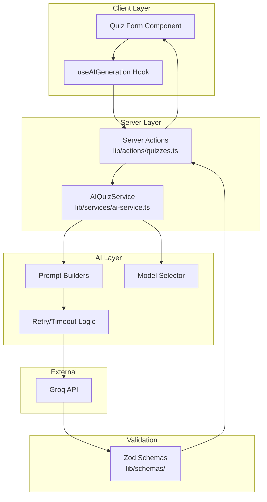
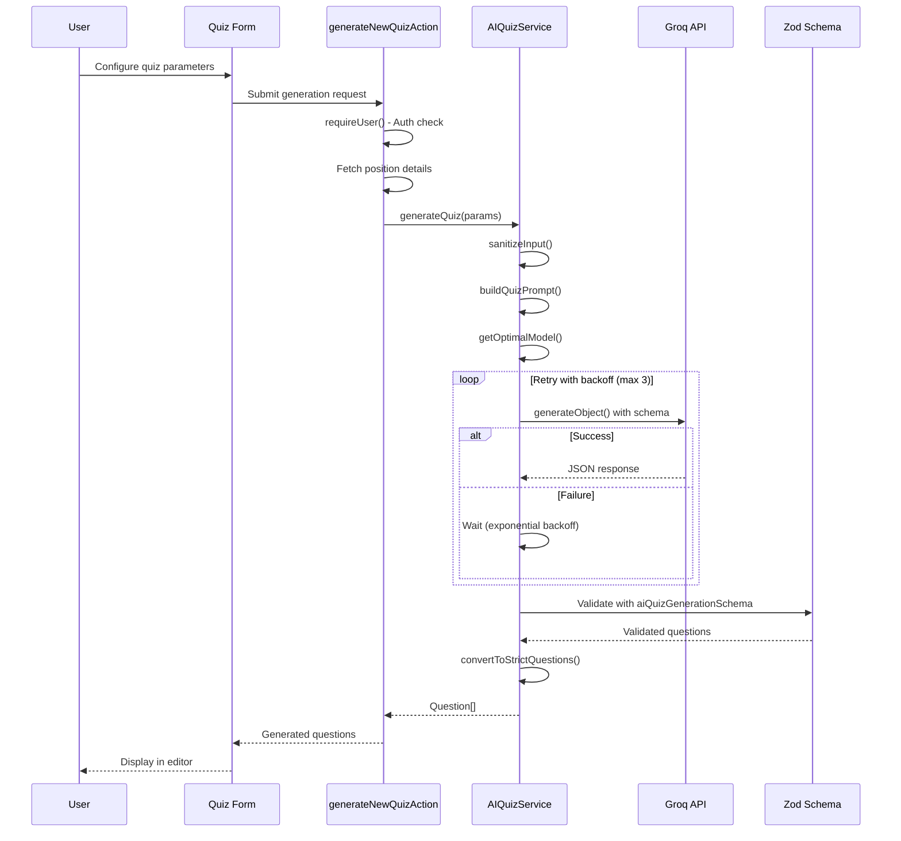
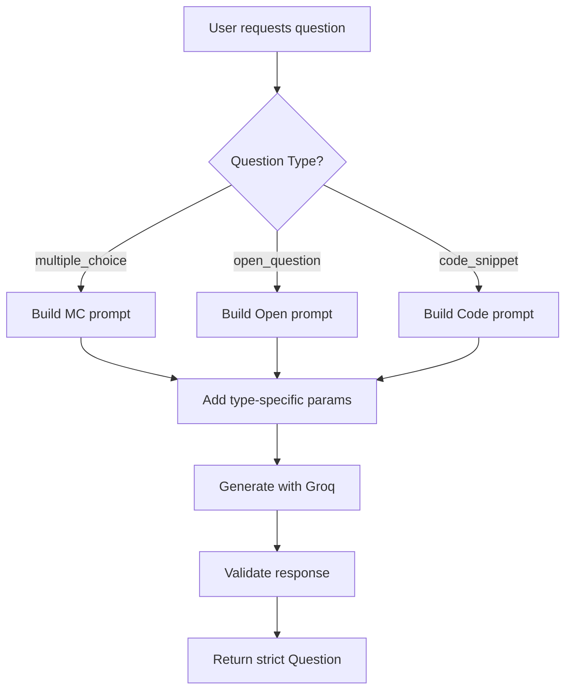
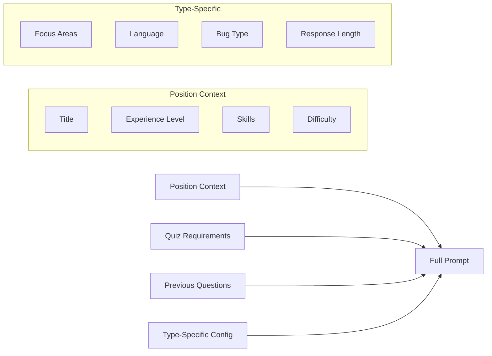
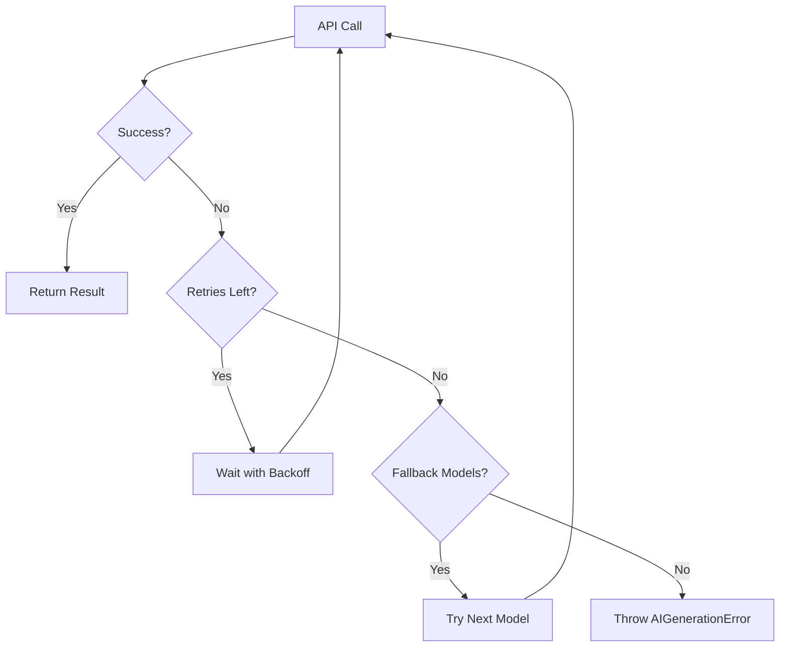
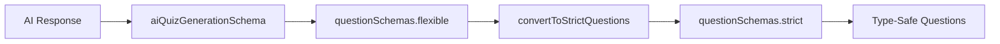

# AI Quiz Generation System

This document provides a comprehensive overview of the AI-powered quiz generation system in DevRecruit. The system leverages Groq's LLM APIs through the Vercel AI SDK to generate technical assessment questions tailored to specific job positions.

## Table of Contents

- [Overview](#overview)
- [Architecture](#architecture)
- [Generation Flow](#generation-flow)
- [Question Types](#question-types)
- [Prompt Engineering](#prompt-engineering)
- [Model Selection](#model-selection)
- [Error Handling](#error-handling)
- [Validation](#validation)
- [Usage Examples](#usage-examples)

## Overview

The AI Quiz Generation system enables recruiters to automatically generate technical assessment quizzes based on:

- **Position requirements** (title, skills, experience level)
- **Quiz configuration** (question count, difficulty, question types)
- **Custom instructions** (additional context or focus areas)

All generated content is in **Italian** to match the target user base.

## Architecture



### Key Components

| Component                   | Location                     | Purpose                                          |
| --------------------------- | ---------------------------- | ------------------------------------------------ |
| `AIQuizService`             | `lib/services/ai-service.ts` | Main service class for AI generation             |
| `generateNewQuizAction`     | `lib/actions/quizzes.ts`     | Server action for full quiz generation           |
| `generateNewQuestionAction` | `lib/actions/quizzes.ts`     | Server action for single question generation     |
| `useAIGeneration`           | `hooks/use-ai-generation.ts` | React hook for client-side generation management |
| Question Schemas            | `lib/schemas/question.ts`    | Zod schemas for question validation              |

## Generation Flow

### Full Quiz Generation



### Single Question Generation

For regenerating or adding individual questions:



## Question Types

### 1. Multiple Choice (`multiple_choice`)

Auto-validated questions with four options.

**Schema Requirements:**

```typescript
{
  id: "q1",                           // Format: q{number}
  type: "multiple_choice",
  question: "Italian question text",
  options: ["Option A", "Option B", "Option C", "Option D"],  // Min 4, each min 3 chars
  correctAnswer: 0,                   // Zero-based index (0-3)
  keywords: ["keyword1"],             // Optional
  explanation: "Why this is correct"  // Optional
}
```

**Type-Specific Parameters:**

- `focusAreas?: string[]` - Specific topics to cover
- `distractorComplexity?: "simple" | "moderate" | "complex"` - How plausible wrong answers should be

### 2. Open Question (`open_question`)

Free-form text responses with sample answers.

**Schema Requirements:**

```typescript
{
  id: "q2",
  type: "open_question",
  question: "Italian question text",
  sampleAnswer: "Expected answer content",  // Required
  keywords: ["important", "concepts"],       // Optional
  sampleSolution: "// code if applicable",   // Optional
  codeSnippet: "// reference code",          // Optional
  explanation: "Evaluation guidance"         // Optional
}
```

**Type-Specific Parameters:**

- `requireCodeExample?: boolean` - Should include code in answer
- `expectedResponseLength?: "short" | "medium" | "long"` - Expected answer length
- `evaluationCriteria?: string[]` - What to look for in answers

### 3. Code Snippet (`code_snippet`)

Code analysis, bug fixing, or improvement tasks.

**Schema Requirements:**

```typescript
{
  id: "q3",
  type: "code_snippet",
  question: "Italian question (no code here)",
  codeSnippet: "// Code to analyze",         // Required
  sampleSolution: "// Corrected code",       // Required
  language: "javascript",                     // Required
  keywords: ["async", "await"],               // Optional
  explanation: "Why this fix works"           // Optional
}
```

**Type-Specific Parameters:**

- `language?: string` - Programming language (auto-inferred from skills if not specified)
- `bugType?: "syntax" | "logic" | "performance" | "security"` - Type of bug to include
- `codeComplexity?: "basic" | "intermediate" | "advanced"` - Code difficulty level
- `includeComments?: boolean` - Whether to include code comments

## Prompt Engineering

### System Prompt Structure

Each question type has a specialized system prompt that:

1. **Defines the AI's role** - Technical recruitment expert
2. **Specifies output format** - Exact JSON structure required
3. **Lists required/optional fields** - Schema documentation
4. **Provides quality guidelines** - What makes a good question
5. **Includes examples** - Concrete JSON examples

### User Prompt Components



### Input Sanitization

All user inputs are sanitized before prompt construction:

```typescript
export function sanitizeInput(input: string): string {
  // Remove prompt injection patterns
  const dangerous_patterns = [
    /ignore\s+previous\s+instructions/gi,
    /forget\s+everything\s+above/gi,
    /you\s+are\s+now/gi,
    // ... more patterns
  ];

  let sanitized = input;
  dangerous_patterns.forEach((pattern) => {
    sanitized = sanitized.replace(pattern, "[filtered]");
  });

  // Limit length to prevent token exhaustion
  return sanitized.substring(0, 2000);
}
```

## Model Selection

The system dynamically selects the optimal LLM model based on task type:

```typescript
export const getOptimalModel = (
  taskType: LLMTaskType,
  specificModel?: string
): string => {
  if (specificModel) return specificModel; // User override

  switch (taskType) {
    case "quiz_generation":
      return LLM_MODELS.KIMI; // Complex multi-question
    case "question_generation":
      return LLM_MODELS.KIMI; // Single question
    case "evaluation":
      return LLM_MODELS.KIMI; // Answer scoring
    case "simple_task":
      return LLM_MODELS.KIMI; // Basic tasks
    default:
      return LLM_MODELS.KIMI;
  }
};
```

### Available Models

| Model ID                           | Context | Best For                |
| ---------------------------------- | ------- | ----------------------- |
| `llama-3.3-70b-versatile`          | 128K    | Complex quiz generation |
| `llama-3.1-8b-instant`             | 128K    | Fast single questions   |
| `gemma2-9b-it`                     | 8K      | General tasks           |
| `deepseek-r1-distill-llama-70b`    | 128K    | Reasoning/evaluation    |
| `moonshotai/kimi-k2-instruct-0905` | Large   | Current default         |

## Error Handling

### Retry Strategy



**Configuration:**

```typescript
const DEFAULT_CONFIG = {
  maxRetries: 3,
  retryDelay: 1000, // 1s base, exponential: 1s, 2s, 4s
  timeout: 60000, // 60 seconds
  fallbackModels: [
    "llama-3.3-70b-versatile",
    "llama-3.1-8b-instant",
    "gemma2-9b-it",
  ],
};
```

### Error Types

```typescript
export enum AIErrorCode {
  GENERATION_FAILED = "GENERATION_FAILED", // AI couldn't generate
  MODEL_UNAVAILABLE = "MODEL_UNAVAILABLE", // Model not accessible
  TIMEOUT = "TIMEOUT", // Request timeout
  INVALID_RESPONSE = "INVALID_RESPONSE", // Schema validation failed
  RATE_LIMITED = "RATE_LIMITED", // API rate limit
  CONTENT_FILTERED = "CONTENT_FILTERED", // Content moderation
  QUOTA_EXCEEDED = "QUOTA_EXCEEDED", // API quota
}
```

## Validation

### Schema Pipeline



### Flexible vs Strict Schemas

**Flexible Schema** - Parsing AI responses:

- Accepts optional fields
- Coerces types where possible
- Validates type-specific requirements via `superRefine`

**Strict Schema** - Runtime type safety:

- Discriminated union by question type
- All required fields enforced
- Type guards for narrowing

### Conversion Process

```typescript
export const convertToStrictQuestion = (
  flexibleQuestion: FlexibleQuestion
): Question => {
  // Normalize missing fields
  if (question.type === "open_question" && !question.sampleAnswer) {
    question.sampleAnswer = "Sample answer to be provided";
  }

  if (question.type === "code_snippet") {
    if (!question.sampleSolution) {
      question.sampleSolution = "// Sample solution to be provided";
    }
    if (!question.language) {
      question.language = "javascript";
    }
  }

  return questionSchemas.strict.parse(question);
};
```

## Usage Examples

### Generate a Full Quiz

```typescript
// Server action call
const result = await generateNewQuizAction({
  positionId: "position-123",
  quizTitle: "Senior React Developer Assessment",
  questionCount: 5,
  difficulty: 4,
  includeMultipleChoice: true,
  includeOpenQuestions: true,
  includeCodeSnippets: true,
  instructions: "Focus on React Hooks and TypeScript",
  specificModel: "llama-3.3-70b-versatile",
});

// Result: { questions: Question[] }
```

### Generate a Single Question (Hook)

```typescript
const { handleGenerateQuestion } = useAIGeneration({ ... });

// Multiple choice with focus areas
await handleGenerateQuestion("multiple_choice", {
  llmModel: "llama-3.3-70b-versatile",
  difficulty: 4,
  focusAreas: ["React Hooks", "State Management"],
  distractorComplexity: "complex",
});

// Code snippet with bug fixing
await handleGenerateQuestion("code_snippet", {
  llmModel: "llama-3.3-70b-versatile",
  difficulty: 4,
  language: "typescript",
  bugType: "security",
  codeComplexity: "advanced",
});
```

### Direct Service Usage

```typescript
import { aiQuizService } from "@/lib/services/ai-service";

const quiz = await aiQuizService.generateQuiz({
  positionTitle: "Backend Engineer",
  experienceLevel: "senior",
  skills: ["Node.js", "PostgreSQL", "TypeScript"],
  quizTitle: "Backend Assessment",
  questionCount: 3,
  difficulty: 4,
  includeMultipleChoice: true,
  includeOpenQuestions: false,
  includeCodeSnippets: true,
});
```

## Performance Considerations

1. **Token Usage** - Prompts are optimized to minimize token count while maintaining quality
2. **Caching** - Quiz configurations can be saved as presets for reuse
3. **Streaming** - Position descriptions use streaming for better UX
4. **Parallel Generation** - Consider generating questions in parallel for large quizzes

## Related Documentation

- [Question Schemas Reference](./QUESTION_SCHEMAS.md) - Detailed Zod schema documentation
- [Cache Implementation](./CACHE_IMPLEMENTATION.md) - Server-side caching patterns
