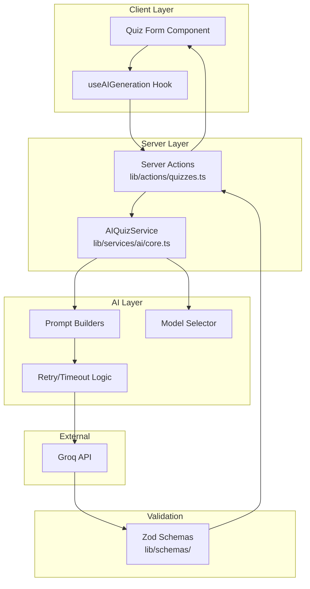
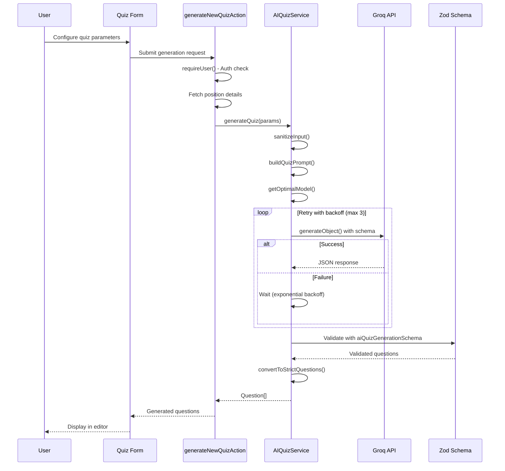
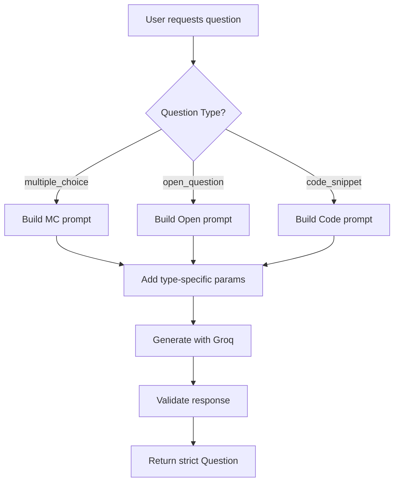
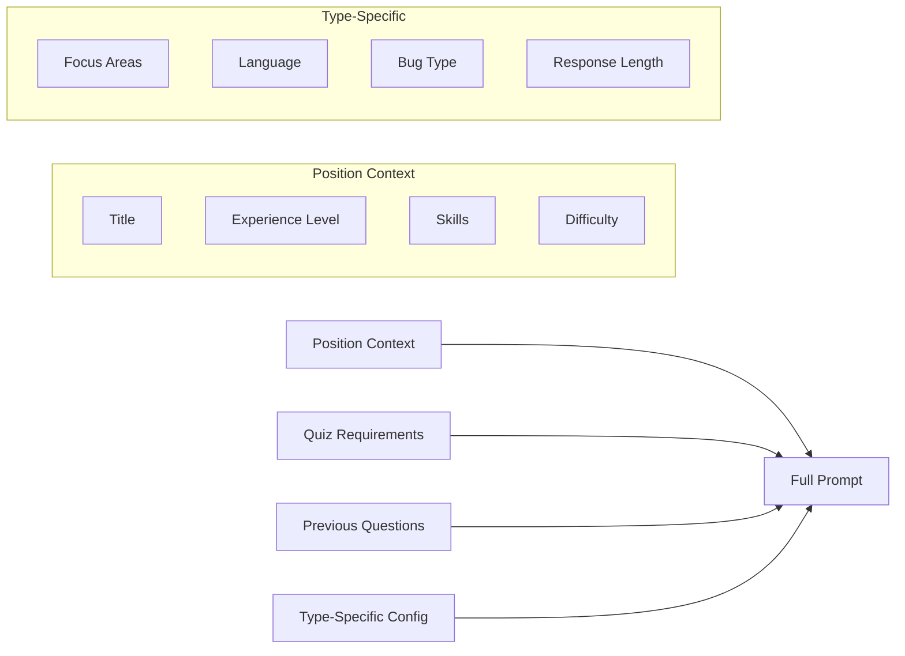
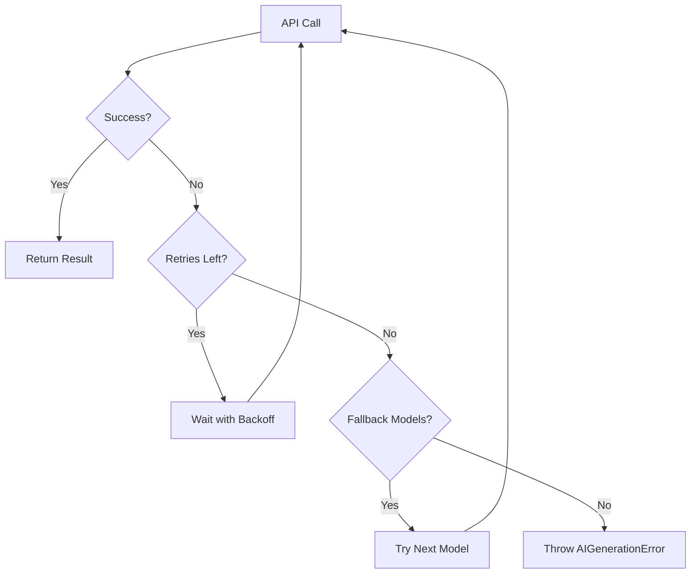
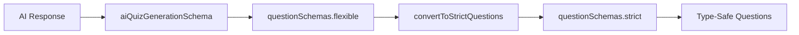
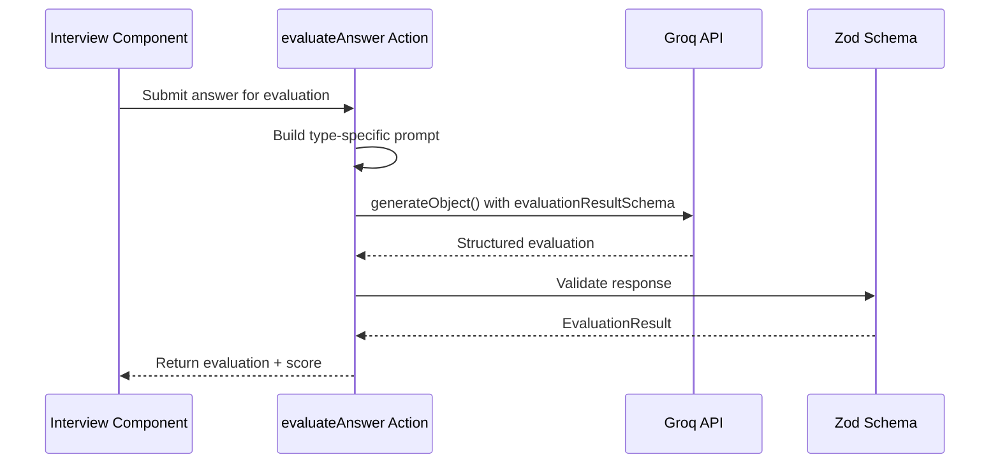
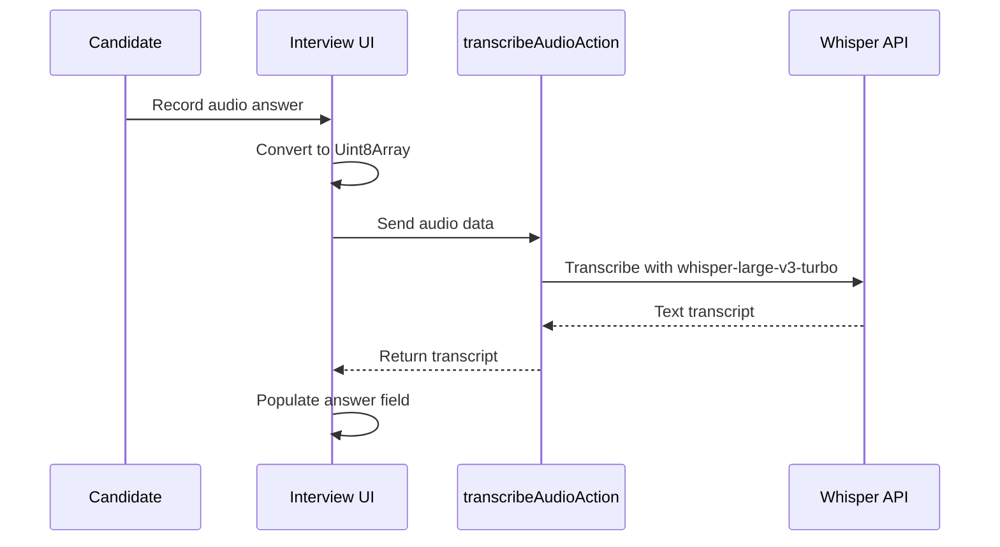

# AI Quiz Generation System

This document provides a comprehensive overview of the AI-powered quiz generation system in DevRecruit. The system leverages Groq's LLM APIs through the Vercel AI SDK to generate technical assessment questions tailored to specific job positions.

## Table of Contents

- [AI Evaluations](#ai-evaluations)
- [Presets System](#presets-system)
- [Streaming Responses](#streaming-responses)
- [Audio Transcription](#audio-transcription)
- [Performance Considerations](#performance-considerations)
- [Related Documentation](#related-documentation)

## Overview

The AI Quiz Generation system enables recruiters to automatically generate technical assessment quizzes based on:

- **Position requirements** (title, skills, experience level)
- **Quiz configuration** (question count, difficulty, question types)
- **Custom instructions** (additional context or focus areas)

All generated content is in **Italian** to match the target user base.

## Architecture



### Key Components

| Component                     | Location                           | Purpose                                          |
| ----------------------------- | ---------------------------------- | ------------------------------------------------ |
| `AIQuizService`               | `lib/services/ai/core.ts`          | Main service class for AI generation             |
| `generateNewQuizAction`       | `lib/actions/quizzes.ts`           | Server action for full quiz generation           |
| `generateNewQuestionAction`   | `lib/actions/quizzes.ts`           | Server action for single question generation     |
| `useAIGeneration`             | `hooks/use-ai-generation.ts`       | React hook for client-side generation management |
| Question Schemas              | `lib/schemas/question.ts`          | Zod schemas for question validation              |
| `evaluateAnswer`              | `lib/actions/evaluations.ts`       | Server action for answer evaluation              |
| `generateCandidateEvaluation` | `lib/actions/evaluation-entity.ts` | Resume-based candidate assessment                |
| `streamPositionDescription`   | `lib/services/ai/streaming.ts`     | Streaming position description generation        |
| `transcribeAudioAction`       | `lib/actions/transcription.ts`     | Audio transcription using Whisper                |
| Preset Management             | `lib/actions/presets.ts`           | Question generation template management          |
| Logging                       | `lib/services/logger.ts`           | Scoped AI logger (`aiLogger`)                    |

> **Note:** The AI service is modular - `lib/services/ai-service.ts` re-exports from `lib/services/ai/` for backward compatibility. The actual implementation is split across `core.ts`, `prompts.ts`, `retry.ts`, `streaming.ts`, `sanitize.ts`, and `types.ts`.

## Generation Flow

### Full Quiz Generation



### Single Question Generation

For regenerating or adding individual questions:



## Question Types

### 1. Multiple Choice (`multiple_choice`)

Auto-validated questions with four options.

**Schema Requirements:**

```typescript
{
  type: "multiple_choice",
  question: "Italian question text",
  options: ["Option A", "Option B", "Option C", "Option D"],  // Min 4, each min 3 chars
  correctAnswer: 0,                   // Zero-based index (0-3)
  keywords: ["keyword1"],             // Optional
  explanation: "Why this is correct"  // Optional
}
```

**Type-Specific Parameters:**

- `focusAreas?: string[]` - Specific topics to cover
- `distractorComplexity?: "simple" | "moderate" | "complex"` - How plausible wrong answers should be

### 2. Open Question (`open_question`)

Free-form text responses with sample answers.

**Schema Requirements:**

```typescript
{
  type: "open_question",
  question: "Italian question text",
  sampleAnswer: "Expected answer content",  // Required
  keywords: ["important", "concepts"],       // Optional
  sampleSolution: "// code if applicable",   // Optional
  codeSnippet: "// reference code",          // Optional
  explanation: "Evaluation guidance"         // Optional
}
```

**Type-Specific Parameters:**

- `expectedResponseLength?: "short" | "medium" | "long"` - Expected answer length
- `evaluationCriteria?: string[]` - What to look for in answers

### 3. Code Snippet (`code_snippet`)

Code analysis, bug fixing, or improvement tasks.

**Schema Requirements:**

```typescript
{
  type: "code_snippet",
  question: "Italian question (no code here)",
  codeSnippet: "// Code to analyze",         // Required
  sampleSolution: "// Corrected code",       // Required
  language: "javascript",                     // Required
  keywords: ["async", "await"],               // Optional
  explanation: "Why this fix works"           // Optional
}
```

**Type-Specific Parameters:**

- `language?: string` - Programming language (auto-inferred from skills if not specified)
- `bugType?: "syntax" | "logic" | "performance" | "security"` - Type of bug to include
- `codeComplexity?: "basic" | "intermediate" | "advanced"` - Code difficulty level
- `includeComments?: boolean` - Whether to include code comments

### 4. Behavioral Scenario (`behavioral_scenario`)

Situational questions focused on judgment, communication, and collaboration.

**Schema Requirements:**

```typescript
{
  type: "behavioral_scenario",
  question: "Italian scenario question text",
  sampleAnswer: "Strong example response",  // Required
  keywords: ["collaboration", "trade-offs"], // Optional
  explanation: "Evaluation guidance"         // Optional
}
```

**Type-Specific Parameters:**

- `expectedResponseLength?: "short" | "medium" | "long"` - Expected response length
- `evaluationCriteria?: string[]` - What to look for in answers

## Prompt Engineering

### System Prompt Structure

Each question type has a specialized system prompt that:

1. **Defines the AI's role** - Technical recruitment expert
2. **Specifies output format** - Exact JSON structure required
3. **Lists required/optional fields** - Schema documentation
4. **Provides quality guidelines** - What makes a good question
5. **Includes examples** - Concrete JSON examples

### User Prompt Components



### Input Sanitization

All user inputs are sanitized before prompt construction:

```typescript
export function sanitizeInput(input: string): string {
  // Remove prompt injection patterns
  const dangerous_patterns = [
    /ignore\s+previous\s+instructions/gi,
    /forget\s+everything\s+above/gi,
    /you\s+are\s+now/gi,
    // ... more patterns
  ];

  let sanitized = input;
  dangerous_patterns.forEach((pattern) => {
    sanitized = sanitized.replace(pattern, "[filtered]");
  });

  // Limit length to prevent token exhaustion
  return sanitized.substring(0, 2000);
}
```

## Model Selection

The system dynamically selects the optimal LLM model based on task type:

```typescript
export const getOptimalModel = (
  taskType: LLMTaskType,
  specificModel?: string,
): string => {
  if (specificModel) return specificModel; // User override

  switch (taskType) {
    case "quiz_generation":
      return LLM_MODELS.KIMI; // 262K context, 16K output
    case "question_generation":
      return LLM_MODELS.VERSATILE; // Reliable production model
    case "evaluation":
    case "overall_evaluation":
      return LLM_MODELS.GPT_OSS_120B; // Reasoning + JSON Mode
    case "resume_evaluation":
      return LLM_MODELS.KIMI; // Large context for full resume
    case "simple_task":
      return LLM_MODELS.INSTANT; // Fastest
    default:
      return LLM_MODELS.VERSATILE;
  }
};
```

### Available Models (December 2025)

#### Production Models

| Model ID                       | Context | Output | Speed    | Best For                           |
| ------------------------------ | ------- | ------ | -------- | ---------------------------------- |
| `llama-3.3-70b-versatile`      | 131K    | 32K    | 280 tps  | Complex tasks, single question gen |
| `llama-3.1-8b-instant`         | 131K    | 131K   | 560 tps  | Simple tasks, fast responses       |
| `openai/gpt-oss-120b`          | 131K    | 65K    | 500 tps  | Evaluation, reasoning, JSON Mode   |
| `openai/gpt-oss-20b`           | 131K    | 65K    | 1000 tps | Faster reasoning, fallback         |
| `meta-llama/llama-guard-4-12b` | 131K    | 1K     | 1200 tps | Content moderation                 |
| `groq/compound`                | 131K    | 8K     | 450 tps  | Agentic tasks with tools           |
| `groq/compound-mini`           | 131K    | 8K     | 450 tps  | Lightweight agentic tasks          |

#### Preview Models (Evaluate before production)

| Model ID                                        | Context | Output | Speed   | Best For                                |
| ----------------------------------------------- | ------- | ------ | ------- | --------------------------------------- |
| `moonshotai/kimi-k2-instruct-0905`              | 262K    | 16K    | 200 tps | Quiz gen, resume analysis (largest ctx) |
| `meta-llama/llama-4-maverick-17b-128e-instruct` | 131K    | 8K     | 600 tps | Fast preview tasks                      |
| `meta-llama/llama-4-scout-17b-16e-instruct`     | 131K    | 8K     | 750 tps | Fastest Llama 4                         |
| `qwen/qwen3-32b`                                | 131K    | 40K    | 400 tps | Multilingual tasks                      |

#### Audio Models

| Model ID                 | Best For                 |
| ------------------------ | ------------------------ |
| `whisper-large-v3`       | Audio transcription      |
| `whisper-large-v3-turbo` | Fast audio transcription |

### Task-Model Mapping Rationale

| Task Type             | Model        | Why                                               |
| --------------------- | ------------ | ------------------------------------------------- |
| `quiz_generation`     | KIMI         | 262K context for position + multi-question output |
| `question_generation` | VERSATILE    | Reliable, 32K output sufficient for 1 question    |
| `evaluation`          | GPT_OSS_120B | Native JSON Mode, reasoning capabilities          |
| `overall_evaluation`  | GPT_OSS_120B | Structured assessment with detailed feedback      |
| `resume_evaluation`   | KIMI         | 262K context for full resume + position match     |
| `simple_task`         | INSTANT      | 560 tps, cheapest, fast responses                 |

## Temperature Configuration

The system uses different temperature settings based on the task type to balance creativity and consistency:

| Task Type                   | Temperature | Seed | Purpose                                             | File                               |
| --------------------------- | ----------- | ---- | --------------------------------------------------- | ---------------------------------- |
| Quiz Generation             | 0.7         | —    | High creativity for diverse questions               | `lib/services/ai/core.ts`          |
| Question Generation         | 0.7         | —    | Varied question content                             | `lib/services/ai/core.ts`          |
| Position Description        | 0.7         | —    | Creative text generation                            | `lib/services/ai/streaming.ts`     |
| Answer Evaluation           | 0.0         | 42   | **Deterministic**, identical outputs for same input | `lib/actions/evaluations.ts`       |
| Overall Quiz Evaluation     | 0.0         | 42   | **Deterministic**, reproducible assessments         | `lib/actions/evaluations.ts`       |
| Resume/Candidate Evaluation | 0.0         | 42   | **Deterministic**, reproducible candidate scores    | `lib/actions/evaluation-entity.ts` |

**Why Different Temperatures?**

- **High temperature (0.7)** - Used for content generation where variety is desirable. Each quiz should have unique questions, and position descriptions should feel fresh.
- **Zero temperature (0.0) + Fixed seed (42)** - Used for evaluations where **exact reproducibility** is critical. Evaluating the same quiz or resume multiple times with identical input will produce the **same evaluation and score**.

**Temperature Scale:**

- `0.0` - **Completely deterministic** — same input always produces same output (ideal for evaluations)
- `0.1-0.3` - Very consistent with minor wording variations
- `0.5` - Balanced between consistency and creativity
- `0.7-1.0` - More creative but less predictable

## Available AI Parameters (Groq API)

| Parameter               | Supported | Range/Type | Use Case                                       |
| ----------------------- | --------- | ---------- | ---------------------------------------------- |
| `temperature`           | ✅        | 0-2        | Control randomness (0 = deterministic)         |
| `top_p`                 | ✅        | 0-1        | Nucleus sampling (alternative to temperature)  |
| `seed`                  | ✅        | integer    | **Reproducible outputs** with same seed + temp |
| `max_completion_tokens` | ✅        | integer    | Limit output length                            |
| `stop`                  | ✅        | string[]   | Stop sequences                                 |
| `frequency_penalty`     | ❌        | -2 to 2    | Not yet supported by Groq models               |
| `presence_penalty`      | ❌        | -2 to 2    | Not yet supported by Groq models               |
| `logprobs`              | ❌        | boolean    | Not yet supported by Groq models               |

**Best Practices:**

- Use `temperature` OR `top_p`, not both simultaneously
- For evaluations: `temperature: 0.0` + `seed: 42` = maximum reproducibility
- For creative tasks: `temperature: 0.7` without seed = varied outputs

**Example Configuration:**

```typescript
// High temperature for creative content
const quizResult = await generateText({
  model: groq(model),
  prompt,
  output: Output.object(quizSchema),
  temperature: 0.7, // Creative quiz generation
  // No seed — we want variety
});

// Zero temperature + seed for deterministic evaluations
const evalResult = await generateText({
  model: groq(model),
  prompt,
  output: Output.object(evalSchema),
  temperature: 0.0, // Deterministic
  seed: 42, // Fixed seed — same input = identical output
});
```

## Error Handling

### Retry Strategy



**Configuration:**

```typescript
const DEFAULT_CONFIG = {
  maxRetries: 3,
  retryDelay: 1000, // 1s base, exponential: 1s, 2s, 4s
  timeout: 60000, // 60 seconds
  fallbackModels: [
    "llama-3.3-70b-versatile", // Production - reliable
    "openai/gpt-oss-20b", // Production - fast reasoning
    "llama-3.1-8b-instant", // Production - fastest
  ],
};
```

### Error Types

```typescript
export enum AIErrorCode {
  GENERATION_FAILED = "GENERATION_FAILED", // AI couldn't generate
  MODEL_UNAVAILABLE = "MODEL_UNAVAILABLE", // Model not accessible
  TIMEOUT = "TIMEOUT", // Request timeout
  INVALID_RESPONSE = "INVALID_RESPONSE", // Schema validation failed
  RATE_LIMITED = "RATE_LIMITED", // API rate limit
  CONTENT_FILTERED = "CONTENT_FILTERED", // Content moderation
  QUOTA_EXCEEDED = "QUOTA_EXCEEDED", // API quota
}
```

## Validation

### Schema Pipeline



### Flexible vs Strict Schemas

**Flexible Schema** - Parsing AI responses:

- Accepts optional fields
- Coerces types where possible
- Validates type-specific requirements via `superRefine`

**Strict Schema** - Runtime type safety:

- Discriminated union by question type
- All required fields enforced
- Type guards for narrowing

### Conversion Process

```typescript
export const convertToStrictQuestion = (
  flexibleQuestion: FlexibleQuestion,
): Question => {
  // Normalize missing fields
  if (question.type === "open_question" && !question.sampleAnswer) {
    question.sampleAnswer = "Sample answer to be provided";
  }

  if (question.type === "behavioral_scenario" && !question.sampleAnswer) {
    question.sampleAnswer = "Sample answer to be provided";
  }

  if (question.type === "code_snippet") {
    if (!question.sampleSolution) {
      question.sampleSolution = "// Sample solution to be provided";
    }
    if (!question.language) {
      question.language = "javascript";
    }
  }

  return questionSchemas.strict.parse(question);
};
```

## Usage Examples

### Generate a Full Quiz

```typescript
// Server action call
const result = await generateNewQuizAction({
  positionId: "position-123",
  quizTitle: "Senior React Developer Assessment",
  questionCount: 5,
  difficulty: 4,
  includeMultipleChoice: true,
  includeOpenQuestions: true,
  includeCodeSnippets: true,
  includeBehavioralScenarios: true,
  instructions: "Focus on React Hooks and TypeScript",
  specificModel: "llama-3.3-70b-versatile",
});

// Result: { questions: Question[] }
```

### Generate a Single Question (Hook)

```typescript
const { handleGenerateQuestion } = useAIGeneration({ ... });

// Multiple choice with focus areas
await handleGenerateQuestion("multiple_choice", {
  llmModel: "llama-3.3-70b-versatile",
  difficulty: 4,
  focusAreas: ["React Hooks", "State Management"],
  distractorComplexity: "complex",
});

// Code snippet with bug fixing
await handleGenerateQuestion("code_snippet", {
  llmModel: "llama-3.3-70b-versatile",
  difficulty: 4,
  language: "typescript",
  bugType: "security",
  codeComplexity: "advanced",
});
```

### Direct Service Usage

```typescript
import { aiQuizService } from "@/lib/services/ai-service";

const quiz = await aiQuizService.generateQuiz({
  positionTitle: "Backend Engineer",
  experienceLevel: "senior",
  skills: ["Node.js", "PostgreSQL", "TypeScript"],
  quizTitle: "Backend Assessment",
  questionCount: 3,
  difficulty: 4,
  includeMultipleChoice: true,
  includeOpenQuestions: false,
  includeCodeSnippets: true,
  includeBehavioralScenarios: false,
});
```

## Performance Considerations

1. **Token Usage** - Prompts are optimized to minimize token count while maintaining quality
2. **Caching** - Quiz configurations can be saved as presets for reuse
3. **Streaming** - Position descriptions use streaming for better UX
4. **Parallel Generation** - Consider generating questions in parallel for large quizzes

## AI Evaluations

The system provides two types of AI-powered evaluations:

### Interview Evaluations

Evaluates candidate answers to quiz questions with structured feedback.

**Location**: `lib/actions/evaluations.ts`

**Capabilities**:

- Answer correctness scoring (0-10 scale)
- Detailed evaluation text
- Strengths and weaknesses identification
- Type-specific evaluation logic for each question type
- **Consistent scoring** with low temperature (0.1) for reproducible results

**Schema**:

```typescript
const evaluationResultSchema = z.object({
  evaluation: z.string(),
  score: z.number().min(0).max(10),
  strengths: z.array(z.string()),
  weaknesses: z.array(z.string()),
});
```

**Usage Example**:

```typescript
import { evaluateAnswer } from "@/lib/actions/evaluations";

const result = await evaluateAnswer(
  question, // FlexibleQuestion
  candidateAnswer, // string
  "llama-3.3-70b-versatile", // optional model override
);

// Result: { evaluation, score, strengths, weaknesses, maxScore }
```

**Evaluation Flow**:



### Candidate Evaluations

Evaluates candidates based on their resume against position requirements.

**Location**: `lib/actions/evaluation-entity.ts`

**Capabilities**:

- PDF resume text extraction using `unpdf`
- Skills match analysis
- Experience level assessment
- Soft skills evaluation
- Overall fit score (0-100 scale)
- Recommendations for next steps
- **Consistent assessments** with low temperature (0.2) for reproducible results

**Schema**:

```typescript
const overallEvaluationSchema = z.object({
  evaluation: z.string(),
  strengths: z.array(z.string()),
  weaknesses: z.array(z.string()),
  recommendation: z.string(),
  fitScore: z.number().min(0).max(100),
});
```

**Usage Example**:

```typescript
import { generateCandidateEvaluationAction } from "@/lib/actions/evaluation-entity";

const result = await generateCandidateEvaluationAction({
  candidateId: "candidate-123",
  positionId: "position-456",
});

// Creates Evaluation entity with AI assessment
```

**Evaluation Entity (Polymorphic)**:
The `Evaluation` model supports both types:

```prisma
model Evaluation {
  id    String @id
  title String

  // Polymorphic: one of these will be set
  interviewId String? @unique  // 1:1 with interview (quiz-based)
  candidateId String?          // Many evaluations per candidate
  positionId  String?          // Required for candidate evals

  // AI evaluation content
  evaluation     String?
  strengths      String[]
  weaknesses     String[]
  recommendation String?
  fitScore       Int?     // 0-10 for interviews, 0-100 for candidates
  quizScore      Int?     // Only for interview evaluations

  // Manual notes
  notes String?
}
```

## Presets System

Presets provide reusable templates for question generation with type-specific parameters.

**Location**: `lib/actions/presets.ts`, `lib/data/presets.ts`

**Purpose**:

- Standardize question generation across quizzes
- Configure type-specific AI parameters
- Enable quick generation with predefined settings
- Maintain consistency in question quality

**Preset Schema**:

```typescript
model Preset {
  id           String   @id
  name         String   @unique
  label        String
  description  String?
  icon         String   // Lucide icon name
  questionType String   // multiple_choice, code_snippet, open_question
  instructions String?

  // Type-specific parameters
  focusAreas           String[]
  distractorComplexity String?
  expectedResponseLength ExpectedResponseLength?
  evaluationCriteria   String[]
  language             String?
  bugType              String?
  codeComplexity       String?
  includeComments      Boolean?

  // Metadata
  tags       String[]
  difficulty Int      @default(3) // 1-5 scale
  isDefault  Boolean  @default(true)
}
```

**Type-Specific Parameters**:

| Question Type   | Parameters Available                                                     |
| --------------- | ------------------------------------------------------------------------ |
| Multiple Choice | `focusAreas`, `distractorComplexity` (simple/moderate/complex)           |
| Open Question   | `expectedResponseLength`, `evaluationCriteria`                           |
| Code Snippet    | `language`, `bugType`, `codeComplexity`, `includeComments`, `focusAreas` |

**Usage Example**:

```typescript
import { getPresetData } from "@/lib/data/presets";
import { generateNewQuestionAction } from "@/lib/actions/quizzes";

// Get preset configuration
const preset = await getPresetData("react-hooks-advanced");

// Use preset parameters in generation
const result = await generateNewQuestionAction({
  positionId: "pos-123",
  quizId: "quiz-456",
  questionType: preset.questionType,
  difficulty: preset.difficulty,
  focusAreas: preset.focusAreas,
  distractorComplexity: preset.distractorComplexity,
  // ... other preset parameters
});
```

**Preset Management Actions**:

- `getPresetsAction` - Get all presets with pagination/search
- `createPresetAction` - Create new preset
- `updatePresetAction` - Update existing preset
- `deletePresetAction` - Delete preset
- `seedPresetsAction` - Seed default presets

**Seeded Default Presets** (see `prisma/seed.ts`):

- React Hooks (Basic/Advanced)
- JavaScript ES6+ Fundamentals
- TypeScript Type System
- Node.js Best Practices
- SQL Query Optimization
- Security Best Practices
- Algorithm & Data Structures
- System Design Concepts

## Streaming Responses

The system supports streaming AI responses for better UX during long-running operations.

**Location**: `lib/services/ai/streaming.ts` → `streamPositionDescription`

**Use Case**: Position description generation

**Implementation**:

```typescript
import { streamPositionDescription } from "@/lib/services/ai-service";

// Server action or API route
const stream = await streamPositionDescription({
  title: "Senior React Developer",
  experienceLevel: "senior",
  skills: ["React", "TypeScript", "Node.js"],
  softSkills: ["Communication", "Leadership"],
  contractType: "full-time",
  currentDescription: "...", // optional - for refinement
});

// Return stream to client
return stream.toTextStreamResponse();
```

**API Endpoint**:

```typescript
// app/api/positions/generate-description/route.ts
export async function POST(request: NextRequest) {
  await requireUser();
  const body = await request.json();
  const validated = positionDescriptionSchema.parse(body);

  const stream = await streamPositionDescription(validated);
  return stream.toTextStreamResponse();
}
```

**Client Usage**:

```typescript
const response = await fetch("/api/positions/generate-description", {
  method: "POST",
  body: JSON.stringify(positionData),
});

const reader = response.body?.getReader();
// Stream chunks to UI
```

**Benefits**:

- Immediate feedback to users
- Perceived performance improvement
- Progressive content display
- Reduced time-to-first-content

## Audio Transcription

The system supports audio transcription for candidate answers using Groq's Whisper models.

**Location**: `lib/actions/transcription.ts`

**Model**: `whisper-large-v3-turbo` (Groq API)

**Implementation**:

```typescript
import { transcribeAudioAction } from "@/lib/actions/transcription";

// Client sends audio as number array (Uint8Array converted)
const audioData = Array.from(uint8Array);

const result = await transcribeAudioAction(audioData);

if (result.success) {
  console.log("Transcribed text:", result.text);
} else {
  console.error("Transcription error:", result.error);
}
```

**Use Cases**:

- Voice input for open questions
- Accessibility features
- Interview recording transcription
- Candidate answer capture

**Technical Details**:

- Accepts audio as `number[]` (serializable for server actions)
- Converts to `Uint8Array` server-side
- Uses Groq's `transcription` model via Vercel AI SDK
- Returns plain text transcript

**Example Flow**:



## Related Documentation

- [Question Schemas Reference](./QUESTION_SCHEMAS.md) - Detailed Zod schema documentation
- [Cache Implementation](./CACHE_IMPLEMENTATION.md) - Server-side caching patterns
