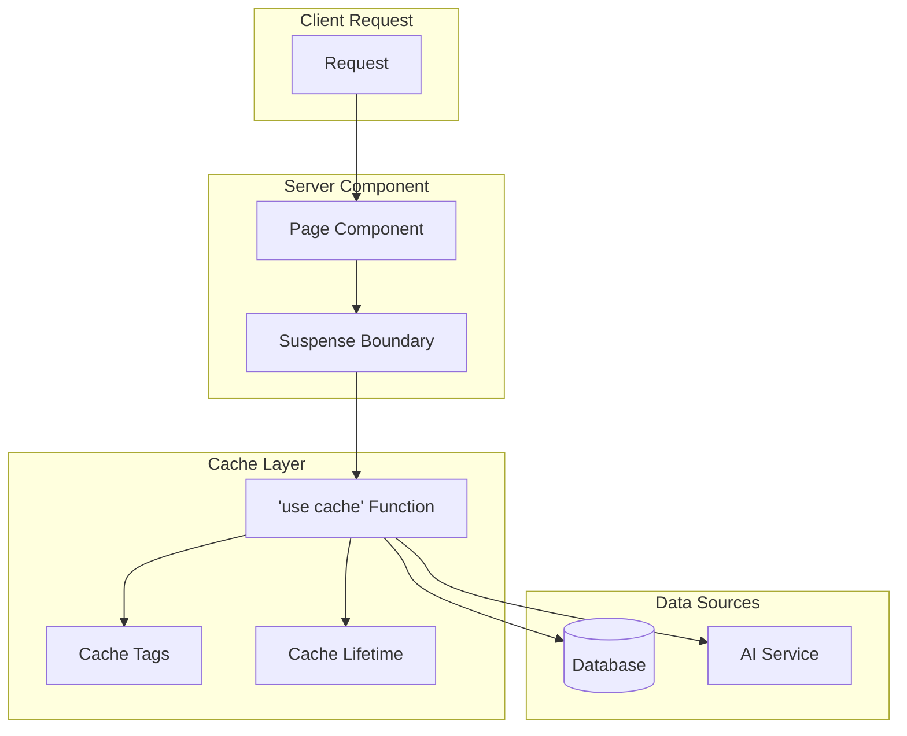
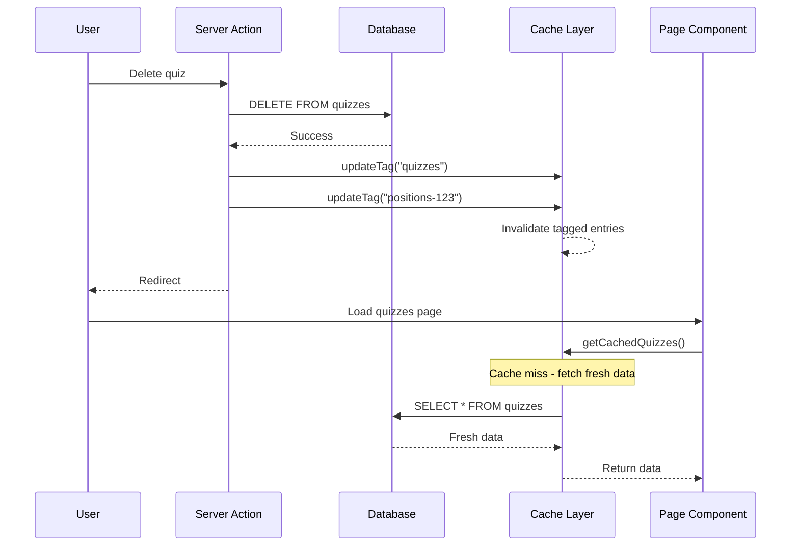

# Cache Implementation Guide

This document describes the caching patterns and strategies used in DevRecruit, leveraging Next.js 16's Cache Components feature.

## Table of Contents

- [Overview](#overview)
- [Cache Components](#cache-components)
- [Caching Patterns](#caching-patterns)
- [Cache Invalidation](#cache-invalidation)
- [Best Practices](#best-practices)
- [Examples](#examples)

## Overview

DevRecruit uses Next.js 16's experimental Cache Components feature for server-side data caching. This provides:

- **Automatic caching** of data fetching functions
- **Tag-based invalidation** for targeted cache updates
- **Configurable cache lifetimes** for different data types
- **Streaming compatibility** with Suspense boundaries



## Cache Components

### Enabling Cache Components

Cache Components are enabled via the `"use cache"` directive:

```typescript
async function getCachedData() {
  "use cache";

  // This function's return value is cached
  return await prisma.quiz.findMany();
}
```

### Cache Lifetime Configuration

Use `cacheLife()` to set cache duration:

```typescript
import { cacheLife } from "next/cache";

async function getQuizzes() {
  "use cache";
  cacheLife("minutes"); // Cache for minutes

  return await prisma.quiz.findMany();
}
```

Available presets:

| Preset      | Duration | Use Case             |
| ----------- | -------- | -------------------- |
| `"seconds"` | ~10s     | Real-time data       |
| `"minutes"` | ~5min    | Dashboard data       |
| `"hours"`   | ~1hr     | Reference data       |
| `"days"`    | ~24hr    | Static content       |
| `"weeks"`   | ~7d      | Rarely changing data |
| `"max"`     | Maximum  | Immutable data       |

### Cache Tags

Use `cacheTag()` for targeted invalidation:

```typescript
import { cacheTag } from "next/cache";

async function getQuizzesByPosition(positionId: string) {
  "use cache";
  cacheTag("quizzes", `positions-${positionId}`);
  cacheLife("minutes");

  return await prisma.quiz.findMany({
    where: { positionId },
  });
}
```

## Caching Patterns

### Pattern 1: Data Layer Caching

All data queries in `lib/data/` follow this pattern:

```typescript
// lib/data/quizzes.ts
import { cacheLife, cacheTag } from "next/cache";
import prisma from "../prisma";

export async function getQuizzes() {
  "use cache";
  cacheTag("quizzes");
  cacheLife("minutes");

  return await prisma.quiz.findMany({
    include: { position: true },
    orderBy: { createdAt: "desc" },
  });
}

export async function getQuizById(quizId: string) {
  "use cache";
  cacheTag("quizzes", `quiz-${quizId}`);
  cacheLife("minutes");

  return await prisma.quiz.findUnique({
    where: { id: quizId },
    include: { position: true },
  });
}
```

### Pattern 2: Page-Level Caching

Server components use Suspense for streaming:

```tsx
// app/dashboard/quizzes/page.tsx
import { Suspense } from "react";
import { QuizzesSkeleton } from "./fallbacks";
import { QuizzesTable } from "./quizzes-components";

export default async function QuizzesPage() {
  return (
    <div>
      <h1>Quizzes</h1>
      <Suspense fallback={<QuizzesSkeleton />}>
        <QuizzesTable />
      </Suspense>
    </div>
  );
}
```

### Pattern 3: Runtime Data Isolation

Wrap runtime APIs in Suspense to avoid cache pollution:

```tsx
// Components using cookies/headers need Suspense
import { cookies } from "next/headers";

async function UserGreeting() {
  const cookieStore = await cookies();
  const theme = cookieStore.get("theme");

  return <span>Theme: {theme?.value}</span>;
}

// In page
<Suspense fallback={<Skeleton />}>
  <UserGreeting />
</Suspense>;
```

## Cache Invalidation

### Centralized Cache Utilities

All cache invalidation MUST use the centralized helpers from `lib/utils/cache-utils.ts`:

```typescript
import {
  invalidateQuizCache,
  invalidateCandidateCache,
  invalidateInterviewCache,
  invalidatePositionCache,
  invalidateEvaluationCache,
  invalidateQuestionCache,
  invalidatePresetCache,
  invalidateProfileCache,
  entityTag,
  CacheTags,
} from "@/lib/utils/cache-utils";

// After mutations, call the appropriate helper:
await prisma.quiz.create({ ... });
invalidateQuizCache();

// For entity-specific invalidation:
await prisma.quiz.update({ where: { id }, ... });
invalidateQuizCache(id);
```

### Available Cache Helpers

| Helper                           | Tags Invalidated                 | Paths Revalidated       |
| -------------------------------- | -------------------------------- | ----------------------- |
| `invalidateQuizCache(id?)`       | `quizzes`, `quiz:{id}`           | `/dashboard/quizzes`    |
| `invalidateCandidateCache(id?)`  | `candidates`, `candidate:{id}`   | `/dashboard/candidates` |
| `invalidateInterviewCache(id?)`  | `interviews`, `interview:{id}`   | `/dashboard/interviews` |
| `invalidatePositionCache(id?)`   | `positions`, `position:{id}`     | `/dashboard/positions`  |
| `invalidateEvaluationCache(id?)` | `evaluations`, `evaluation:{id}` | N/A                     |
| `invalidateQuestionCache(id?)`   | `questions`, `question:{id}`     | N/A                     |
| `invalidatePresetCache(id?)`     | `presets`, `preset:{id}`         | `/dashboard/presets`    |
| `invalidateProfileCache(id?)`    | `profile`, `profile:{id}`        | `/dashboard/profile`    |

### Entity Tag Helper

Use `entityTag()` for consistent entity-specific tag naming:

```typescript
import { entityTag } from "@/lib/utils/cache-utils";

// In cached data functions:
cacheTag(entityTag("quiz", quizId)); // Creates tag "quiz:abc123"

// In mutations:
updateTag(entityTag("quiz", quizId)); // Invalidates "quiz:abc123"
```

### Using updateTag (Direct Usage)

After mutations, invalidate relevant cache tags:

```typescript
// lib/actions/quizzes.ts
import { updateTag } from "next/cache";

export async function deleteQuiz(formData: FormData) {
  "use server";

  const quizId = formData.get("quizId") as string;
  const quiz = await prisma.quiz.findUnique({
    where: { id: quizId },
    select: { positionId: true },
  });

  await prisma.quiz.delete({ where: { id: quizId } });

  // Invalidate Cache Components
  updateTag("quizzes");
  if (quiz?.positionId) {
    updateTag(`positions-${quiz.positionId}`);
  }
}
```

### Cache Invalidation Flow



### Legacy Revalidation Support

For compatibility, also call traditional revalidation:

```typescript
import { revalidatePath, revalidateTag } from "next/cache";

export function revalidateQuizCache(quizId?: string) {
  revalidatePath("/dashboard/quizzes");
  revalidateTag("quizzes");

  if (quizId) {
    revalidatePath(`/dashboard/quizzes/${quizId}`);
  }
}
```

## Best Practices

### Do's ✅

1. **Keep cache scope small** - Cache at the data layer, not components

2. **Use specific tags** - Enable targeted invalidation

   ```typescript
   cacheTag("quizzes", `quiz-${quizId}`, `positions-${positionId}`);
   ```

3. **Wrap runtime APIs** - Isolate dynamic data in Suspense

   ```tsx
   <Suspense fallback={<Skeleton />}>
     <ComponentUsingCookies />
   </Suspense>
   ```

4. **Invalidate after mutations** - Always update relevant tags

   ```typescript
   await prisma.quiz.update({ ... });
   updateTag("quizzes");
   updateTag(`quiz-${quizId}`);
   ```

5. **Use appropriate lifetimes** - Match cache duration to data volatility
   ```typescript
   cacheLife("minutes"); // Dashboard data
   cacheLife("hours"); // Reference data
   ```

### Don'ts ❌

1. **Don't cache user-specific runtime data**

   ```typescript
   // Bad - session data shouldn't be cached
   async function getUser() {
     "use cache"; // ❌
     return await getCurrentUser();
   }
   ```

2. **Don't forget to invalidate**

   ```typescript
   // Bad - cache will be stale
   await prisma.quiz.delete({ ... });
   // Missing: updateTag("quizzes") ❌
   ```

3. **Don't over-cache**

   ```typescript
   // Bad - too aggressive
   cacheLife("max"); // ❌ for frequently changing data
   ```

4. **Don't mix cached and uncached in one function**
   ```typescript
   // Bad - unclear caching behavior
   async function getData() {
     "use cache";
     const cached = await getCachedData();
     const fresh = await getFreshData(); // ❌ This is also cached!
     return { cached, fresh };
   }
   ```

## Examples

### Dashboard Page with Multiple Data Sources

```tsx
// app/dashboard/page.tsx
import { Suspense } from "react";
import {
  StatsSkeleton,
  RecentQuizzesSkeleton,
  RecentCandidatesSkeleton,
} from "./fallbacks";

export default function DashboardPage() {
  return (
    <div className="grid gap-4">
      {/* Stats - cached, updates less frequently */}
      <Suspense fallback={<StatsSkeleton />}>
        <DashboardStats />
      </Suspense>

      {/* Recent items - cached with shorter lifetime */}
      <div className="grid grid-cols-2 gap-4">
        <Suspense fallback={<RecentQuizzesSkeleton />}>
          <RecentQuizzes />
        </Suspense>
        <Suspense fallback={<RecentCandidatesSkeleton />}>
          <RecentCandidates />
        </Suspense>
      </div>
    </div>
  );
}
```

### Server Action with Cache Invalidation

```typescript
// lib/actions/quizzes.ts
export async function upsertQuizAction(formData: FormData) {
  "use server";

  const user = await requireUser();
  const quizId = formData.get("quizId") as string | null;
  const positionId = formData.get("positionId") as string;

  if (quizId) {
    // Update existing
    await prisma.quiz.update({
      where: { id: quizId },
      data: { ... },
    });

    updateTag("quizzes");
    updateTag(`quiz-${quizId}`);
  } else {
    // Create new
    const quiz = await prisma.quiz.create({
      data: { positionId, ... },
    });

    updateTag("quizzes");
    updateTag(`positions-${positionId}`);
  }

  // Also revalidate paths for legacy support
  revalidateQuizCache(quizId || "");
}
```

### Cached Data Function with Error Handling

```typescript
// lib/data/interviews.ts
import { cacheLife, cacheTag } from "next/cache";

export async function getInterviewsWithResults() {
  "use cache";
  cacheTag("interviews");
  cacheLife("minutes");

  try {
    const interviews = await prisma.interview.findMany({
      include: {
        candidate: true,
        quiz: { include: { position: true } },
      },
      orderBy: { createdAt: "desc" },
    });

    return { data: interviews, error: null };
  } catch (error) {
    console.error("Failed to fetch interviews:", error);
    return { data: [], error: "Failed to load interviews" };
  }
}
```

## Debugging Cache

### Check Cache Status

In development, Next.js logs cache hits/misses:

```bash
# Terminal output
○ Compiling /dashboard/quizzes ...
✓ Compiled in 1.2s
GET /dashboard/quizzes 200 in 45ms
  │ Cache: HIT (quizzes)
```

### Force Cache Bypass

During development, add a query param:

```bash
# Bypass cache
http://localhost:3000/dashboard/quizzes?no-cache=1
```

### Clear All Cache

Restart the development server to clear all cached data.

## Related Documentation

- [AI Quiz Generation System](./AI_QUIZ_GENERATION.md) - AI service with caching
- [Question Schemas Reference](./QUESTION_SCHEMAS.md) - Data validation
