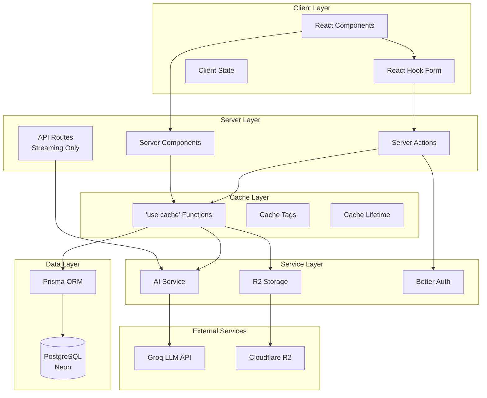
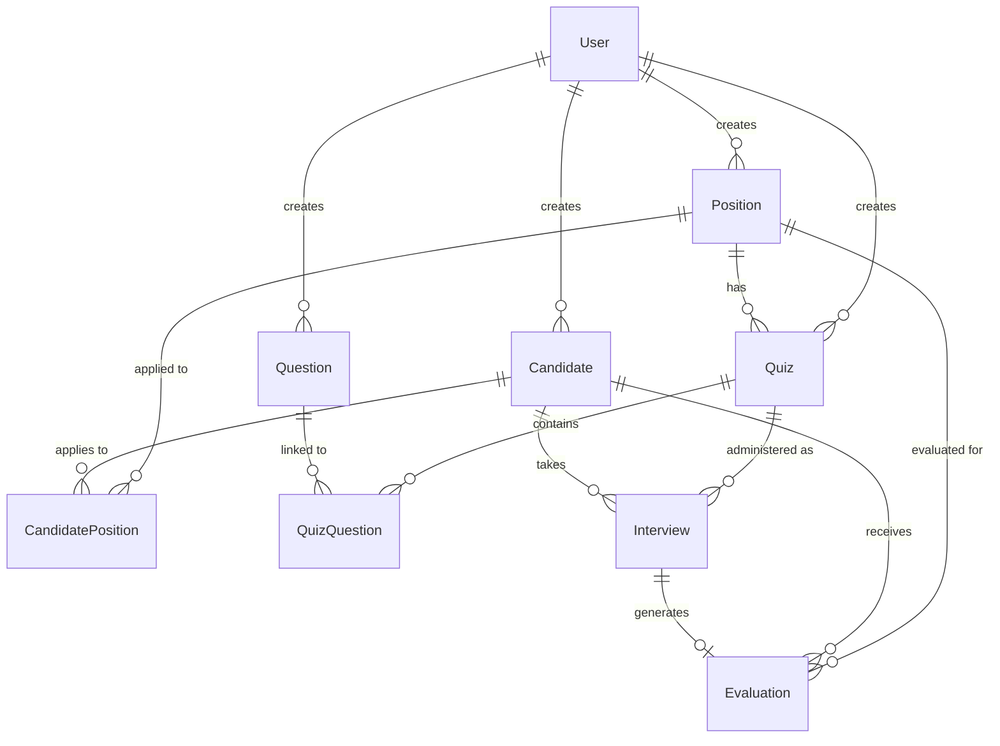
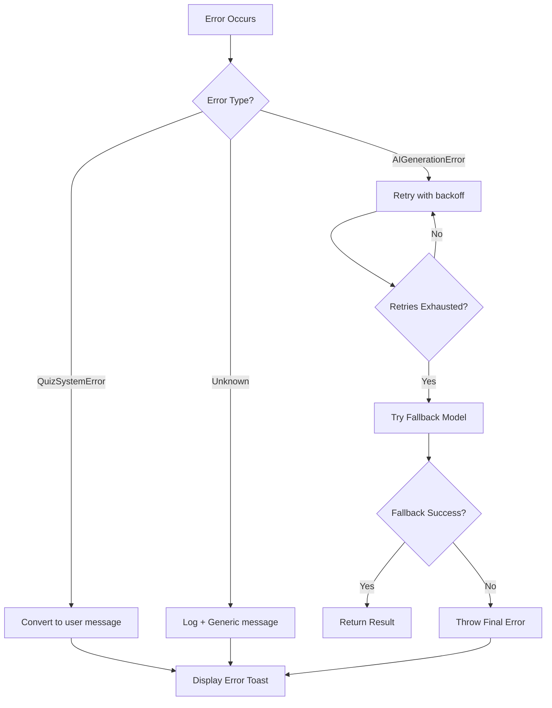
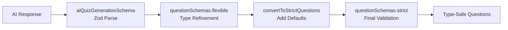
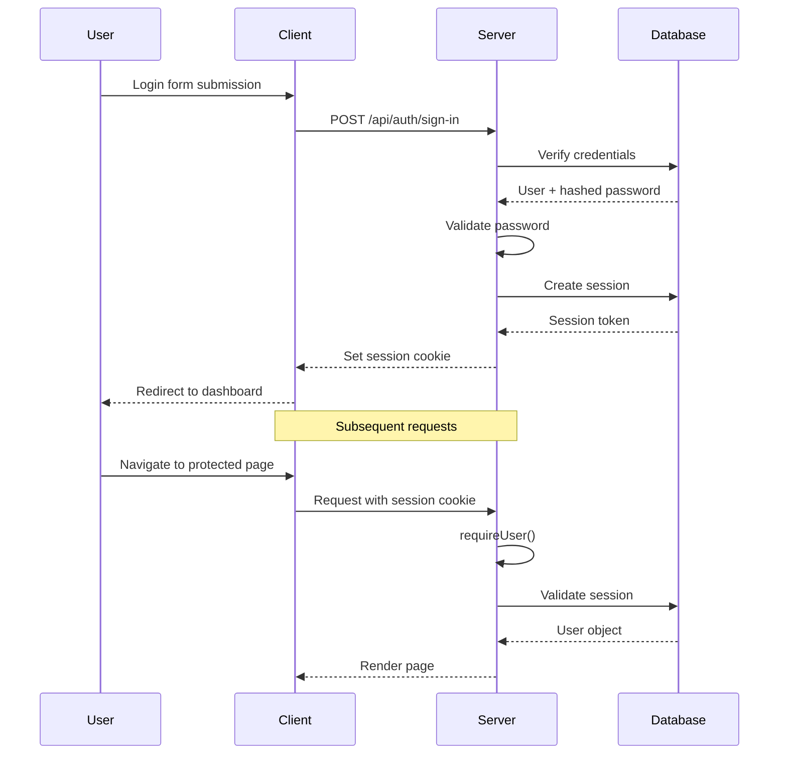
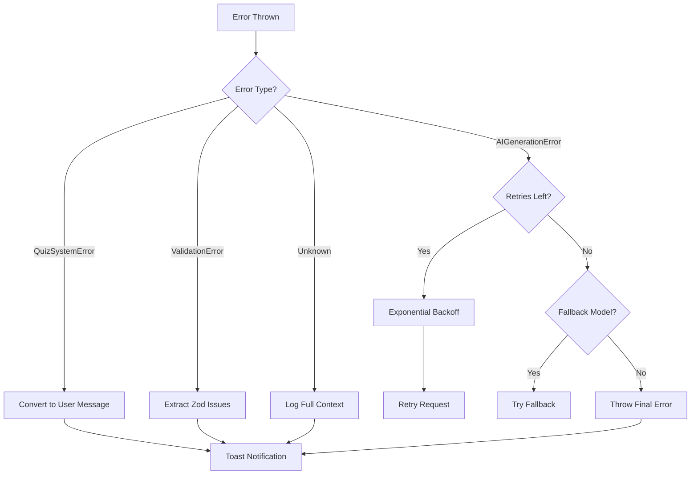
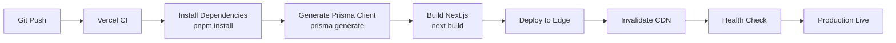

# DevRecruit Project Architecture Blueprint

**Generated:** December 30, 2025  
**Version:** 0.1.1  
**Next.js Version:** 16.1.1  
**Architecture Pattern:** Cache Components with Server Actions

---

## Table of Contents

- [Architecture Overview](#architecture-overview)
- [Technology Stack](#technology-stack)
- [Architectural Principles](#architectural-principles)
- [Layer Architecture](#layer-architecture)
- [Core Architectural Components](#core-architectural-components)
- [Data Architecture](#data-architecture)
- [Cross-Cutting Concerns](#cross-cutting-concerns)
- [Service Communication Patterns](#service-communication-patterns)
- [Next.js 16 Specific Patterns](#nextjs-16-specific-patterns)
- [AI Service Architecture](#ai-service-architecture)
- [Caching Strategy](#caching-strategy)
- [Authentication & Authorization](#authentication--authorization)
- [Error Handling](#error-handling)
- [Testing Architecture](#testing-architecture)
- [Deployment Architecture](#deployment-architecture)
- [Extension Patterns](#extension-patterns)
- [Architectural Decisions](#architectural-decisions)
- [Development Guidelines](#development-guidelines)

---

## Architecture Overview

DevRecruit is an AI-powered technical recruitment platform built with Next.js 16, leveraging modern architectural patterns optimized for performance, maintainability, and developer experience.

### High-Level Architecture



### Guiding Architectural Principles

1. **Server-First Architecture** - Leverage server components by default, use client components only when necessary
2. **Cache Components** - Use Next.js 16 `"use cache"` for optimal performance with granular invalidation
3. **Server Actions over API Routes** - Prefer type-safe server actions for mutations; API routes only for streaming
4. **Type Safety** - End-to-end type safety with TypeScript and Zod validation
5. **Separation of Concerns** - Clear boundaries between routing, data fetching, business logic, and AI services
6. **No Ownership Filtering** - All authenticated users can access all entities (business requirement)
7. **Italian Language** - All user-facing content and AI-generated text is in Italian

---

## Technology Stack

### Core Framework

- **Next.js 16.1.1** - App Router with Cache Components (experimental)
- **React 19.2.3** - Server Components, Suspense, Streaming
- **TypeScript 5.9.3** - Static typing and IntelliSense

### Data Management

- **Prisma 7.2.0** - ORM with PostgreSQL adapter
- **Neon PostgreSQL** - Serverless PostgreSQL database
- **Zod 4.2.1** - Runtime schema validation

### AI & LLM Integration

- **Vercel AI SDK 6.0.3** - Unified AI integration
- **Groq API** - High-speed LLM inference
- **@ai-sdk/groq 3.0.1** - Groq provider for AI SDK
- **unpdf 1.4.0** - PDF text extraction for resume parsing

### Storage

- **Cloudflare R2** - S3-compatible object storage for resumes
- **AWS SDK S3 Client 3.958.0** - R2 integration

### Authentication

- **Better Auth 1.4.9** - Modern authentication library
- **Prisma Adapter** - Better Auth integration with database

### UI & Styling

- **Tailwind CSS 4.1.18** - Utility-first CSS with OKLCH colors
- **shadcn/ui** - Reusable component library
- **Lucide React 0.562.0** - Icon library
- **React Aria Components 1.14.0** - Accessible UI primitives
- **next-themes 0.4.6** - Dark mode support

### Forms & Validation

- **React Hook Form 7.69.0** - Form state management
- **@hookform/resolvers 5.2.2** - Zod integration for forms

### Development Tools

- **Vitest 4.0.16** - Unit testing framework
- **ESLint 9.39.2** - Code linting
- **AI SDK DevTools 0.0.2** - AI request debugging
- **Monaco Editor** - Code editor for quiz questions

---

## Architectural Principles

### 1. Progressive Enhancement

- Static shell rendered at build time
- Dynamic data streamed via Suspense boundaries
- Optimistic UI updates where appropriate

### 2. Data Fetching Strategy

- **Colocation** - Data fetching close to where it's used
- **Parallel Loading** - Independent data sources load concurrently
- **Cache Components** - `"use cache"` for automatic deduplication and caching

### 3. State Management

- **Server State** - Managed via cache components and server actions
- **Client State** - Minimal, scoped to interactive features
- **Form State** - React Hook Form for controlled inputs

### 4. Performance Optimization

- Server Components reduce client-side JavaScript
- Streaming prevents blocking on slow data sources
- Cache tags enable surgical invalidation

### 5. Error Boundaries

- Page-level error boundaries for graceful degradation
- Form-level validation with instant feedback
- Centralized error logging with context

---

## Layer Architecture

### Routing Layer (`app/`)

- **Next.js App Router** - File-based routing with layouts
- **Dynamic segments** - `[id]`, `[token]` for parameterized routes
- **Route groups** - `(auth)`, `(dashboard)` for shared layouts
- **Parallel routes** - Multiple slots for complex UI composition

**Key Files:**

- `app/layout.tsx` - Root layout with theme provider
- `app/dashboard/layout.tsx` - Dashboard shell with sidebar
- `app/dashboard/[section]/page.tsx` - Dynamic section pages

### Data Layer (`lib/data/`)

- **Cache components** - All functions use `"use cache"` directive
- **Cache lifetime** - Hours for dashboard data, minutes for volatile data
- **Cache tags** - Entity-level and collection-level tagging
- **Query optimization** - Prisma includes for reducing N+1 queries

**Patterns:**

```typescript
export async function getQuizzes() {
  "use cache";
  cacheLife("hours");
  cacheTag(CacheTags.QUIZZES);

  return await prisma.quiz.findMany({
    include: { position: true, quizQuestions: { include: { question: true } } },
  });
}
```

### Action Layer (`lib/actions/`)

- **Server actions** - `"use server"` functions for mutations
- **Authentication** - `requireUser()` for protected operations
- **Validation** - Zod schemas for input validation
- **Cache invalidation** - `updateTag()` after mutations
- **Error handling** - Consistent error transformation with `handleActionError`

**Patterns:**

```typescript
export async function createQuizAction(data: FormData) {
  "use server";
  const user = await requireUser();

  // Validate
  const validated = createQuizSchema.parse(data);

  // Mutate
  const quiz = await prisma.quiz.create({ data: validated });

  // Invalidate cache
  invalidateQuizCache({ quizId: quiz.id });

  return { success: true, data: quiz };
}
```

### Service Layer (`lib/services/`)

- **AI Service** - LLM integration for quiz/question generation and evaluation
- **Storage Service** - Cloudflare R2 file uploads/downloads
- **Logger Service** - Structured logging with context
- **Error Handler** - Centralized error classification and reporting

**Separation:**

- Business logic encapsulated in services
- Services are framework-agnostic (testable)
- Clear interfaces between layers

### Schema Layer (`lib/schemas/`)

- **Zod schemas** - Runtime validation and TypeScript inference
- **Flexible vs Strict** - Flexible for AI parsing, strict for runtime
- **Type guards** - Runtime type checking utilities
- **Conversion utilities** - Transform between schema types

---

## Core Architectural Components

### 1. Server Components (Default)

**Purpose:** Render UI on the server with zero client JavaScript

**Structure:**

```tsx
// app/dashboard/quizzes/page.tsx
export default async function QuizzesPage({ searchParams }) {
  return (
    <div>
      <PageHeader title="Quiz" />
      <Suspense fallback={<Skeleton />}>
        <QuizListSection searchParams={searchParams} />
      </Suspense>
    </div>
  );
}
```

**Benefits:**

- Direct database access
- No client bundle size impact
- Automatic request deduplication
- SEO-friendly

**When to use Client Components:**

- Interactive UI (forms, buttons with state)
- Browser APIs (localStorage, geolocation)
- Event handlers (onClick, onChange)
- Hooks (useState, useEffect)

### 2. Cache Components

**Purpose:** Automatically cache function results with granular invalidation

**Implementation:**

```typescript
export async function getQuizById(id: string) {
  "use cache";
  cacheLife("hours");
  cacheTag(CacheTags.QUIZZES, entityTag.quiz(id));

  return await prisma.quiz.findUnique({ where: { id } });
}
```

**Cache Lifetime Presets:**

- `"seconds"` (~10s) - Real-time data
- `"minutes"` (~5min) - Dashboard data
- `"hours"` (~1hr) - Reference data
- `"days"` (~24hr) - Static content

**Invalidation:**

```typescript
// After mutation
updateTag(CacheTags.QUIZZES);
updateTag(entityTag.quiz(quizId));
```

### 3. Server Actions

**Purpose:** Type-safe server functions callable from client components

**Pattern:**

```typescript
export async function deleteQuizAction(quizId: string) {
  "use server";

  const user = await requireUser();
  await prisma.quiz.delete({ where: { id: quizId } });
  invalidateQuizCache({ quizId });

  redirect("/dashboard/quizzes");
}
```

**Client Usage:**

```tsx
"use client";
export function DeleteButton({ quizId }) {
  const handleDelete = async () => {
    await deleteQuizAction(quizId);
  };

  return <button onClick={handleDelete}>Delete</button>;
}
```

### 4. Suspense Boundaries

**Purpose:** Stream content progressively, show fallbacks during loading

**Static Shell Pattern:**

```tsx
export default function Page() {
  return (
    <>
      {/* Static - rendered immediately */}
      <PageHeader title="Quizzes" />

      {/* Dynamic - streams when ready */}
      <Suspense fallback={<QuizListSkeleton />}>
        <QuizList />
      </Suspense>
    </>
  );
}
```

**Rules:**

- Wrap data-fetching components in Suspense
- Isolate runtime APIs (cookies, headers) in Suspense
- Avoid nested Suspense unless necessary
- Use skeleton UI for fallbacks

### 5. Form Components

**Purpose:** Client-side form state with server-side validation

**Structure:**

```tsx
"use client";
export function QuizForm() {
  const form = useForm({
    resolver: zodResolver(quizSchema),
    defaultValues: { title: "", questions: [] },
  });

  const onSubmit = async (data) => {
    const result = await createQuizAction(data);
    if (result.success) {
      toast.success("Quiz created");
      router.push(`/dashboard/quizzes/${result.data.id}`);
    }
  };

  return <form onSubmit={form.handleSubmit(onSubmit)}>...</form>;
}
```

**Pattern:**

- React Hook Form for state management
- Zod resolver for validation
- Server action for submission
- Toast notifications for feedback

---

## Data Architecture

### Domain Model



### Entity Descriptions

#### User

- **Purpose:** Authentication and ownership tracking
- **Key Fields:** email, name, role, banned
- **Relations:** Creates positions, quizzes, candidates, questions

#### Position

- **Purpose:** Job opening definition
- **Key Fields:** title, description, experienceLevel, skills[], softSkills[], contractType
- **Relations:** Has quizzes, candidate applications, evaluations

#### Quiz

- **Purpose:** Technical assessment container
- **Key Fields:** title, timeLimit, positionId
- **Relations:** Linked to questions via QuizQuestion join table

#### Question (Reusable Entity)

- **Purpose:** Database-stored questions reusable across quizzes
- **Key Fields:** type, question, options[], correctAnswer, codeSnippet, language, isFavorite
- **Relations:** Linked to quizzes via QuizQuestion (many-to-many)

#### QuizQuestion (Join Table)

- **Purpose:** Links questions to quizzes with ordering
- **Key Fields:** quizId, questionId, order
- **Pattern:** Enables question reuse and favorites

#### Candidate

- **Purpose:** Job applicant
- **Key Fields:** firstName, lastName, email, resumeUrl, status
- **Relations:** Many-to-many with positions via CandidatePosition

#### CandidatePosition (Join Table)

- **Purpose:** Tracks candidate applications to positions
- **Key Fields:** candidateId, positionId, isPrimary
- **Pattern:** One primary position per candidate

#### Interview

- **Purpose:** Quiz session instance
- **Key Fields:** candidateId, quizId, status, token, answers (JSON), score
- **Relations:** Belongs to candidate and quiz, may have evaluation

#### Evaluation (Polymorphic)

- **Purpose:** AI-generated assessment
- **Patterns:**
  - **Interview Evaluation** (quiz-based): 1:1 with interview, includes quizScore + fitScore
  - **Candidate Evaluation** (resume-based): Many per candidate (different positions), includes fitScore + recommendation
- **Key Fields:** evaluation (text), strengths[], weaknesses[], fitScore, quizScore, recommendation

#### Preset

- **Purpose:** Question generation templates
- **Key Fields:** name, questionType, focusAreas[], difficulty, distractorComplexity, bugType, codeComplexity
- **Usage:** Configure type-specific AI parameters for consistent generation

### Data Access Patterns

#### Repository Pattern (Implicit)

- Data layer functions act as repositories
- Encapsulate Prisma queries
- Return typed DTOs, not Prisma models

**Example:**

```typescript
// lib/data/quizzes.ts
export type QuizResponse = {
  id: string;
  title: string;
  questions: SavedQuestion[];
  positions: { id: string; title: string; experienceLevel: string } | null;
};

export async function getQuizzes(): Promise<QuizResponse[]> {
  "use cache";
  const quizzes = await prisma.quiz.findMany({ include: { position: true } });
  return quizzes.map(mapQuizFromPrisma);
}
```

#### Query Optimization

- **Includes** - Load related entities in one query
- **Select** - Fetch only required fields
- **Ordering** - QuizQuestion includes `orderBy.order` for question sequence
- **Indexing** - Database indexes on foreign keys and frequently queried fields

#### Transaction Patterns

```typescript
await prisma.$transaction(async (tx) => {
  const quiz = await tx.quiz.create({ data: quizData });

  for (let i = 0; i < questions.length; i++) {
    const question = await tx.question.create({ data: questions[i] });
    await tx.quizQuestion.create({
      data: { quizId: quiz.id, questionId: question.id, order: i },
    });
  }

  return quiz;
});
```

### Data Validation

#### Input Validation (Zod)

```typescript
const createQuizSchema = z.object({
  title: z.string().min(1),
  positionId: z.string().cuid(),
  questions: z.array(questionSchemas.flexible),
  timeLimit: z.number().int().positive().optional(),
});
```

#### Output Transformation

- Prisma models → DTOs
- Date objects → ISO strings
- JSON fields → typed objects
- Null coalescing for optional fields

---

## Cross-Cutting Concerns

### Authentication & Authorization

**Implementation:** Better Auth with Prisma adapter

**Configuration:**

```typescript
// lib/auth.ts
export const auth = betterAuth({
  baseURL: process.env.NEXT_PUBLIC_APP_URL,
  database: prismaAdapter(prisma),
  emailAndPassword: { enabled: true, requireEmailVerification: true },
  session: {
    expiresIn: 7 * 24 * 60 * 60, // 7 days
    updateAge: 24 * 60 * 60, // Refresh if > 1 day old
    absoluteTimeout: 30 * 24 * 60 * 60, // Hard limit: 30 days
  },
  plugins: [admin()],
});
```

**Server-Side Usage:**

```typescript
// lib/auth-server.ts
export async function requireUser() {
  const user = await getCurrentUser();
  if (!user) throw new Error("UNAUTHENTICATED");
  return user;
}
```

**Pattern:** No ownership filtering - all authenticated users can access all entities

### Error Handling & Resilience

**Error Taxonomy:**

```typescript
export enum AIErrorCode {
  GENERATION_FAILED,
  MODEL_UNAVAILABLE,
  TIMEOUT,
  INVALID_RESPONSE,
  RATE_LIMITED,
  CONTENT_FILTERED,
  QUOTA_EXCEEDED,
}

export enum QuizErrorCode {
  QUIZ_NOT_FOUND,
  POSITION_NOT_FOUND,
  INVALID_INPUT,
  DATABASE_ERROR,
  UNAUTHORIZED,
}
```

**Error Handling Flow:**



**Retry Strategy:**

```typescript
const DEFAULT_CONFIG = {
  maxRetries: 3,
  retryDelay: 1000, // Exponential: 1s, 2s, 4s
  timeout: 60000,
  fallbackModels: [
    "llama-3.3-70b-versatile",
    "openai/gpt-oss-20b",
    "llama-3.1-8b-instant",
  ],
};
```

### Logging & Monitoring

**Logger Service:**

```typescript
export const logger = {
  debug(message: string, context?: LogContext): void,
  info(message: string, context?: LogContext): void,
  warn(message: string, context?: LogContext): void,
  error(message: string, context?: LogContext): void
};
```

**Scoped Loggers:**

- `aiLogger` - AI service operations
- `dbLogger` - Database operations
- `authLogger` - Authentication events
- `storageLogger` - File storage operations

**Format:**

- **Development:** Human-readable with colors
- **Production:** JSON for log aggregation
- **Context:** Always include relevant metadata
- **Suppression:** No logs during tests

**Example:**

```typescript
aiLogger.info("Quiz generation started", {
  positionId,
  questionCount,
  model,
});
```

### Validation

**Multi-Layer Validation:**

1. **Client-Side** (React Hook Form + Zod)

   - Instant feedback
   - Type-safe form state
   - Field-level validation

2. **Server-Side** (Zod schemas in actions)

   - Security boundary
   - Data integrity
   - Type coercion

3. **AI Output** (Zod schemas for LLM responses)
   - Structured output validation
   - Schema refinement for type-specific rules
   - Conversion to strict types

**Schema Patterns:**

```typescript
// Flexible for parsing
export const flexibleSchema = z
  .object({
    type: z.enum(["multiple_choice", "open_question", "code_snippet"]),
    question: z.string(),
    options: z.array(z.string()).optional(),
    // ... all fields optional
  })
  .superRefine((data, ctx) => {
    // Type-specific validation
  });

// Strict for runtime
export const strictSchema = z.discriminatedUnion("type", [
  multipleChoiceSchema, // All MC fields required
  openQuestionSchema, // All OQ fields required
  codeSnippetSchema, // All CS fields required
]);
```

### Configuration Management

**Environment Variables:**

```typescript
// lib/env.ts
export const env = {
  DATABASE_URL: process.env.DATABASE_URL!,
  GROQ_API_KEY: process.env.GROQ_API_KEY!,
  R2_ACCOUNT_ID: process.env.R2_ACCOUNT_ID!,
  R2_ACCESS_KEY_ID: process.env.R2_ACCESS_KEY_ID!,
  R2_SECRET_ACCESS_KEY: process.env.R2_SECRET_ACCESS_KEY!,
  R2_BUCKET_NAME: process.env.R2_BUCKET_NAME!,
  NEXT_PUBLIC_APP_URL: process.env.NEXT_PUBLIC_APP_URL!,
};
```

**Validation:** Checked at module load, throws if missing required vars

**Secret Management:**

- Never commit secrets to version control
- Use `.env.local` for development
- Use platform environment variables for production (Vercel)

---

## Service Communication Patterns

### Internal Communication (Server Actions)

**Pattern:** Direct function calls from client components to server actions

**Benefits:**

- Type-safe end-to-end
- No serialization overhead
- Automatic request deduplication
- Built-in error handling

**Example:**

```tsx
// Client Component
"use client";
import { createQuizAction } from "@/lib/actions/quizzes";

export function QuizForm() {
  const handleSubmit = async (data) => {
    const result = await createQuizAction(data);
    // Fully typed result
  };
}
```

### External Communication (Groq API)

**Pattern:** AI SDK abstracts HTTP requests

**Configuration:**

```typescript
import { groq } from "@ai-sdk/groq";
import { generateText } from "ai";

const model = groq("llama-3.3-70b-versatile");
const result = await generateText({
  model,
  prompt: buildQuizPrompt(params),
  output: Output.object({ schema: aiQuizGenerationSchema }),
  temperature: 0.7,
});
```

**Resilience:**

- Automatic retries with exponential backoff
- Fallback to alternative models
- Timeout handling (60s default)
- Detailed error logging

### File Storage (Cloudflare R2)

**Pattern:** S3-compatible API via AWS SDK

**Upload Flow:**

```typescript
import { uploadResumeToR2 } from "@/lib/services/r2-storage";

const resumeUrl = await uploadResumeToR2(file, candidateId);
// Returns public URL: https://bucket.account.r2.dev/resumes/candidate-id/timestamp.pdf
```

**Deletion:**

```typescript
await deleteResumeFromR2(resumeUrl);
```

---

## Next.js 16 Specific Patterns

### Cache Components Architecture

**Static Shell + Streaming Content:**

```tsx
export default async function QuizzesPage({ searchParams }) {
  // Static shell (prerendered)
  return (
    <div className="space-y-6">
      <PageHeader title="Quiz" actionBtns={<NewQuizButton />} />

      {/* Streaming content */}
      <Suspense fallback={<FiltersSkeleton />}>
        <SearchAndFilterQuizzes />
      </Suspense>

      <Suspense fallback={<QuizListSkeleton />}>
        <QuizzesRuntimeSection searchParams={searchParams} />
      </Suspense>
    </div>
  );
}
```

**Runtime Section Pattern:**

```tsx
// Normalize searchParams
export const QuizzesRuntimeSection = async ({ searchParams }) => {
  const params = await searchParams;
  const normalized = normalizeSearchParams(params);

  return (
    <Suspense fallback={<QuizListSkeleton />}>
      <QuizListSection {...normalized} />
    </Suspense>
  );
};

// Data fetching with cache
async function QuizListSection(params) {
  const quizzes = await getQuizzes(params);
  return <QuizTable quizzes={quizzes} />;
}
```

### Cache Invalidation Patterns

**After Mutations:**

```typescript
export async function createQuizAction(data: FormData) {
  "use server";

  const quiz = await prisma.quiz.create({ data: validated });

  // Invalidate cache components
  updateTag(CacheTags.QUIZZES);
  updateTag(entityTag.position(quiz.positionId));

  // Legacy path revalidation
  revalidatePath("/dashboard/quizzes");
}
```

**Centralized Helpers:**

```typescript
// lib/utils/cache-utils.ts
export function invalidateQuizCache(options?: {
  quizId?: string;
  positionId?: string;
}) {
  updateTag(CacheTags.QUIZZES);
  if (options?.quizId) {
    updateTag(entityTag.quiz(options.quizId));
    revalidatePath(`/dashboard/quizzes/${options.quizId}`);
  }
  if (options?.positionId) {
    updateTag(entityTag.position(options.positionId));
  }
}
```

### Runtime API Isolation

**Problem:** `cookies()` and `headers()` cannot be used in cached functions

**Solution:** Wrap in Suspense boundaries

```tsx
// DON'T ❌
async function Dashboard() {
  "use cache";
  const cookieStore = await cookies(); // Error!
}

// DO ✅
async function UserSection() {
  const cookieStore = await cookies();
  return <UserGreeting />;
}

export default function Dashboard() {
  return (
    <>
      <Suspense fallback={<Skeleton />}>
        <UserSection />
      </Suspense>
      <Suspense fallback={<Skeleton />}>
        <CachedDataSection />
      </Suspense>
    </>
  );
}
```

---

## AI Service Architecture

### Modular Structure

```
lib/services/ai/
├── core.ts          # AIQuizService class, main generation logic
├── prompts.ts       # Prompt builders (system + user)
├── retry.ts         # Retry/timeout utilities
├── streaming.ts     # Streaming implementations
├── sanitize.ts      # Input sanitization
└── types.ts         # Type definitions
```

### Model Selection Strategy

```typescript
export const getOptimalModel = (
  taskType: LLMTaskType,
  specificModel?: string
): string => {
  if (specificModel) return specificModel;

  switch (taskType) {
    case "quiz_generation":
      return "moonshotai/kimi-k2-instruct-0905"; // 262K context
    case "question_generation":
      return "llama-3.3-70b-versatile"; // Reliable
    case "evaluation":
      return "openai/gpt-oss-120b"; // JSON Mode + Reasoning
    case "resume_evaluation":
      return "moonshotai/kimi-k2-instruct-0905"; // Large context
    case "simple_task":
      return "llama-3.1-8b-instant"; // Fast
    default:
      return "llama-3.3-70b-versatile";
  }
};
```

### Temperature Configuration

| Task Type                   | Temperature | Seed | Purpose                      |
| --------------------------- | ----------- | ---- | ---------------------------- |
| Quiz/Question Generation    | 0.7         | —    | Creative, varied questions   |
| Position Description        | 0.7         | —    | Natural language generation  |
| Answer Evaluation           | 0.0         | 42   | **Deterministic** scoring    |
| Candidate/Resume Evaluation | 0.0         | 42   | **Reproducible** assessments |

**Rationale:**

- High temperature (0.7) = Creativity for content generation
- Zero temperature (0.0) + seed = Exact same output for same input (critical for fair evaluations)

### Prompt Engineering

**System Prompt Structure:**

1. Role definition ("You are a technical recruitment expert")
2. Output format requirements (JSON schema)
3. Quality guidelines
4. Examples

**User Prompt Components:**

- Position context (title, experience level, skills)
- Quiz requirements (question count, difficulty)
- Type-specific parameters (focus areas, bug type, etc.)
- Previous questions (for diversity)

**Input Sanitization:**

```typescript
export function sanitizeInput(input: string): string {
  const dangerous_patterns = [
    /ignore\s+previous\s+instructions/gi,
    /forget\s+everything\s+above/gi,
    /you\s+are\s+now/gi,
    // ... more injection patterns
  ];

  let sanitized = input;
  dangerous_patterns.forEach((pattern) => {
    sanitized = sanitized.replace(pattern, "[filtered]");
  });

  return sanitized.substring(0, 2000); // Limit length
}
```

### AI Service Usage Patterns

**Full Quiz Generation:**

```typescript
const result = await aiQuizService.generateQuiz({
  positionTitle: "Senior React Developer",
  experienceLevel: "senior",
  skills: ["React", "TypeScript"],
  quizTitle: "React Assessment",
  questionCount: 5,
  difficulty: 4,
  includeMultipleChoice: true,
  includeOpenQuestions: true,
  includeCodeSnippets: true,
});
```

**Single Question Generation:**

```typescript
const question = await aiQuizService.generateQuestion({
  positionTitle: "Backend Engineer",
  experienceLevel: "senior",
  skills: ["Node.js"],
  type: "code_snippet",
  difficulty: 4,
  language: "javascript",
  bugType: "security",
  codeComplexity: "advanced",
});
```

**Streaming Position Description:**

```typescript
const stream = await streamPositionDescription({
  title: "Full Stack Developer",
  experienceLevel: "mid",
  skills: ["React", "Node.js"],
  softSkills: ["Communication"],
  contractType: "full-time",
});

return stream.toTextStreamResponse();
```

### Validation Pipeline



---

## Caching Strategy

### Cache Hierarchy

```
Global Tags (Collections)
├── CacheTags.QUIZZES          # All quizzes
├── CacheTags.QUESTIONS        # All questions
├── CacheTags.POSITIONS        # All positions
├── CacheTags.CANDIDATES       # All candidates
├── CacheTags.INTERVIEWS       # All interviews
├── CacheTags.EVALUATIONS      # All evaluations
└── CacheTags.PRESETS          # All presets

Entity Tags (Specific Items)
├── entityTag.quiz(id)         # quiz-{id}
├── entityTag.question(id)     # question-{id}
├── entityTag.position(id)     # positions-{id}
├── entityTag.candidate(id)    # candidate-{id}
├── entityTag.interview(id)    # interview-{id}
└── entityTag.evaluation(id)   # evaluation-{id}
```

### Cache Lifetime Strategy

| Data Type          | Lifetime | Rationale                       |
| ------------------ | -------- | ------------------------------- |
| Quiz list          | hours    | Rarely changes, list view       |
| Single quiz        | hours    | Rarely changes, detail view     |
| Positions          | hours    | Rarely changes, reference data  |
| Candidates         | minutes  | Status updates more frequent    |
| Interviews         | minutes  | Active sessions need fresh data |
| Filter options     | hours    | Derived from positions          |
| Favorite questions | hours    | Manual curation, stable         |

### Invalidation Patterns

**After Create:**

```typescript
// Invalidate collection tag
updateTag(CacheTags.QUIZZES);

// Invalidate related entity tags
updateTag(entityTag.position(positionId));

// Revalidate list pages
revalidatePath("/dashboard/quizzes");
```

**After Update:**

```typescript
// Invalidate entity tag
updateTag(entityTag.quiz(quizId));

// Invalidate collection tag
updateTag(CacheTags.QUIZZES);

// Revalidate detail pages
revalidatePath(`/dashboard/quizzes/${quizId}`);
```

**After Delete:**

```typescript
// Same as update + redirect
updateTag(entityTag.quiz(quizId));
updateTag(CacheTags.QUIZZES);
redirect("/dashboard/quizzes");
```

### Cache Component Best Practices

✅ **Do:**

- Cache at the data layer (`lib/data/`)
- Use specific cache tags for targeted invalidation
- Match cache lifetime to data volatility
- Wrap runtime APIs in Suspense boundaries

❌ **Don't:**

- Cache user-specific runtime data (cookies, headers)
- Forget to invalidate after mutations
- Over-cache with `cacheLife("max")` for volatile data
- Mix cached and uncached functions

---

## Authentication & Authorization

### Better Auth Configuration

**Session Management:**

- Token expires: 7 days
- Refresh threshold: 1 day (auto-refresh if older)
- Absolute timeout: 30 days (force re-login)

**Email & Password:**

- Email verification required
- Password hashing via Better Auth internals
- No custom password rules (relies on defaults)

### Authentication Flow



### Authorization Pattern

**No Ownership Filtering:**

```typescript
// Business requirement: All authenticated users can access all entities
export async function getQuizzes() {
  "use cache";

  // NO createdBy filter
  return await prisma.quiz.findMany();
}
```

**Protection Level:**

- Public routes: `/`, `/auth/*`
- Protected routes: `/dashboard/*` (requires authentication)
- No role-based access control (all users have equal permissions)

### Session Refresh

**Automatic:** Better Auth refreshes session tokens when `updateAge` threshold is exceeded

**Manual:** SessionRefreshProvider in dashboard layout monitors session expiration

```tsx
"use client";
export function SessionRefreshProvider() {
  useEffect(() => {
    const interval = setInterval(async () => {
      const session = await auth.api.getSession();
      if (!session) {
        router.push("/auth/login");
      }
    }, 60000); // Check every minute

    return () => clearInterval(interval);
  }, []);

  return null;
}
```

---

## Error Handling

### Error Classification

```typescript
// Service-level errors
export class AIGenerationError extends Error {
  code: AIErrorCode;
  details?: Record<string, unknown>;
}

export class QuizSystemError extends Error {
  code: QuizErrorCode;
  details?: Record<string, unknown>;
}

// Validation errors
export class ValidationError extends Error {
  issues: ZodIssue[];
}
```

### Error Handling Flow



### Retry Configuration

```typescript
export const withRetry = async <T>(
  fn: () => Promise<T>,
  config: AIGenerationConfig
): Promise<T> => {
  let lastError: Error;

  for (let i = 0; i <= config.maxRetries; i++) {
    try {
      return await fn();
    } catch (error) {
      lastError = error;

      if (i < config.maxRetries) {
        const delay = config.retryDelay * Math.pow(2, i);
        await new Promise((resolve) => setTimeout(resolve, delay));
      }
    }
  }

  throw lastError;
};
```

### User-Friendly Error Messages

```typescript
export function getUserFriendlyErrorMessage(error: QuizSystemError): string {
  const messages: Record<QuizErrorCode, string> = {
    [QuizErrorCode.QUIZ_NOT_FOUND]: "Quiz non trovato",
    [QuizErrorCode.POSITION_NOT_FOUND]: "Posizione non trovata",
    [QuizErrorCode.INVALID_INPUT]: "Input non valido",
    [QuizErrorCode.DATABASE_ERROR]: "Errore database",
    [QuizErrorCode.UNAUTHORIZED]: "Non autorizzato",
  };

  return messages[error.code] || "Errore sconosciuto";
}
```

---

## Testing Architecture

### Testing Stack

- **Vitest 4.0.16** - Test runner
- **@testing-library/react 16.3.1** - Component testing
- **happy-dom 20.0.11** - DOM simulation
- **@vitest/coverage-v8** - Coverage reporting

### Test Structure

```
tests/
├── setup.ts              # Global test setup
├── hooks/                # Hook tests
├── lib/
│   ├── actions/          # Server action tests
│   ├── data/             # Data layer tests
│   ├── services/         # Service tests
│   └── utils/            # Utility tests
└── mocks/                # Mock data and services
```

### Testing Patterns

**Component Tests:**

```typescript
import { render, screen } from "@testing-library/react";
import { QuizCard } from "@/components/quiz/quiz-card";

describe("QuizCard", () => {
  it("renders quiz title", () => {
    render(<QuizCard quiz={mockQuiz} />);
    expect(screen.getByText("React Assessment")).toBeInTheDocument();
  });
});
```

**Server Action Tests:**

```typescript
import { createQuizAction } from "@/lib/actions/quizzes";
import { mockUser } from "@/tests/mocks/user";

vi.mock("@/lib/auth-server", () => ({
  requireUser: vi.fn().mockResolvedValue(mockUser),
}));

describe("createQuizAction", () => {
  it("creates quiz and invalidates cache", async () => {
    const result = await createQuizAction(formData);
    expect(result.success).toBe(true);
    expect(updateTag).toHaveBeenCalledWith(CacheTags.QUIZZES);
  });
});
```

**Service Tests:**

```typescript
import { aiQuizService } from "@/lib/services/ai-service";

describe("AIQuizService", () => {
  it("generates quiz with correct structure", async () => {
    const result = await aiQuizService.generateQuiz(params);
    expect(result.questions).toHaveLength(5);
    expect(result.questions[0].type).toBe("multiple_choice");
  });
});
```

---

## Deployment Architecture

### Hosting Platform

**Vercel** - Optimized for Next.js with:

- Automatic CI/CD from GitHub
- Edge Functions for API routes
- Incremental Static Regeneration
- Built-in caching and CDN

### Database

**Neon PostgreSQL** - Serverless database with:

- Automatic scaling
- Connection pooling
- Point-in-time recovery
- Branch database for previews

### File Storage

**Cloudflare R2** - Object storage for resumes:

- S3-compatible API
- Low cost, no egress fees
- Global CDN

### Environment Configuration

**Development:**

```bash
DATABASE_URL="postgresql://..."
GROQ_API_KEY="gsk_..."
R2_ACCOUNT_ID="..."
R2_ACCESS_KEY_ID="..."
R2_SECRET_ACCESS_KEY="..."
R2_BUCKET_NAME="dev-recruit-resumes"
NEXT_PUBLIC_APP_URL="http://localhost:3000"
```

**Production:**

- Environment variables managed via Vercel dashboard
- Secrets encrypted at rest
- Branch-specific environment variables for staging

### Build Process



**Build Commands:**

```json
{
  "scripts": {
    "prebuild": "npm run db:generate",
    "build": "next build",
    "start": "next start"
  }
}
```

---

## Extension Patterns

### Adding a New Entity

**1. Database Schema:**

```prisma
model NewEntity {
  id        String   @id @default(cuid())
  name      String
  createdBy String
  createdAt DateTime @default(now())

  creator User @relation(fields: [createdBy], references: [id])
}
```

**2. Generate Client:**

```bash
pnpm db:generate
pnpm db:push
```

**3. Data Layer:**

```typescript
// lib/data/new-entities.ts
export async function getNewEntities() {
  "use cache";
  cacheTag(CacheTags.NEW_ENTITIES);
  cacheLife("hours");

  return await prisma.newEntity.findMany();
}
```

**4. Server Actions:**

```typescript
// lib/actions/new-entities.ts
export async function createNewEntityAction(data: FormData) {
  "use server";
  const user = await requireUser();
  const validated = createNewEntitySchema.parse(data);

  const entity = await prisma.newEntity.create({ data: validated });
  invalidateNewEntityCache({ entityId: entity.id });

  return { success: true, data: entity };
}
```

**5. UI Components:**

```tsx
// app/dashboard/new-entities/page.tsx
export default async function NewEntitiesPage() {
  return (
    <div>
      <PageHeader title="New Entities" />
      <Suspense fallback={<Skeleton />}>
        <NewEntityList />
      </Suspense>
    </div>
  );
}
```

### Adding a New AI Feature

**1. Define Types:**

```typescript
// lib/services/ai/types.ts
export type GenerateNewFeatureParams = {
  input: string;
  difficulty: number;
  specificModel?: string;
};
```

**2. Build Prompt:**

```typescript
// lib/services/ai/prompts.ts
export function buildNewFeaturePrompt(
  params: GenerateNewFeatureParams
): string {
  return `Generate a new feature based on: ${params.input}`;
}
```

**3. Add Service Method:**

```typescript
// lib/services/ai/core.ts
export class AIQuizService {
  async generateNewFeature(params: GenerateNewFeatureParams) {
    const model = groq(getOptimalModel("simple_task", params.specificModel));
    return await generateText({ model, prompt: buildNewFeaturePrompt(params) });
  }
}
```

**4. Create Server Action:**

```typescript
// lib/actions/new-feature.ts
export async function generateNewFeatureAction(
  params: GenerateNewFeatureParams
) {
  "use server";
  const user = await requireUser();
  return await aiQuizService.generateNewFeature(params);
}
```

### Adding a New Question Type

**1. Update Schema:**

```prisma
enum QuestionType {
  multiple_choice
  open_question
  code_snippet
  new_type  // Add new type
}
```

**2. Define Zod Schema:**

```typescript
// lib/schemas/question.ts
const newTypeQuestionSchema = baseQuestionSchema.extend({
  type: z.literal("new_type"),
  newField: z.string(),
  // ... new type-specific fields
});

export const strictSchema = z.discriminatedUnion("type", [
  multipleChoiceQuestionSchema,
  openQuestionSchema,
  codeSnippetQuestionSchema,
  newTypeQuestionSchema, // Add to union
]);
```

**3. Add Type Guard:**

```typescript
export function isNewTypeQuestion(q: Question): q is NewTypeQuestion {
  return q.type === "new_type";
}
```

**4. Build Prompt:**

```typescript
// lib/services/ai/prompts.ts
export function buildNewTypePrompt(params: GenerateQuestionParams): string {
  return `Generate a new type question for ${params.positionTitle}`;
}
```

**5. Update UI:**

```tsx
// components/quiz/question-display.tsx
export function QuestionDisplay({ question }: { question: Question }) {
  if (isNewTypeQuestion(question)) {
    return <NewTypeQuestionView question={question} />;
  }
  // ... existing types
}
```

---

## Architectural Decisions

### ADR-001: Cache Components over Traditional Caching

**Context:** Need efficient caching with granular invalidation

**Decision:** Use Next.js 16 Cache Components with `"use cache"` directive

**Rationale:**

- Automatic request deduplication
- Tag-based invalidation (surgical updates)
- Built-in cache lifetime management
- Better DX than manual cache keys

**Alternatives Considered:**

- React Query - Additional client dependency
- Redis - Infrastructure overhead
- Traditional ISR - Coarse-grained invalidation

**Consequences:**

- Requires Next.js 16+ (experimental feature)
- Server-only caching (no client-side cache)
- Must wrap runtime APIs in Suspense

### ADR-002: Server Actions over API Routes

**Context:** Need type-safe communication between client and server

**Decision:** Use server actions for all mutations, API routes only for streaming

**Rationale:**

- End-to-end type safety
- No need for fetch() boilerplate
- Automatic request deduplication
- Simplified error handling
- Better DX with direct function calls

**Alternatives Considered:**

- tRPC - Additional abstraction layer
- GraphQL - Over-engineering for this scale
- REST API - Loses type safety, more boilerplate

**Consequences:**

- Server actions cannot return streams (use API routes for streaming)
- Must use `"use server"` directive
- FormData serialization for complex objects

### ADR-003: Groq for LLM Inference

**Context:** Need fast, cost-effective LLM inference

**Decision:** Use Groq API via Vercel AI SDK

**Rationale:**

- Fastest inference speed (280-1200 tokens/sec)
- Lower cost than OpenAI
- Multiple model options (Llama, Mixtral, Qwen)
- Native JSON Mode support
- Vercel AI SDK abstraction

**Alternatives Considered:**

- OpenAI - More expensive, slower
- Anthropic - No JSON Mode
- Self-hosted - Infrastructure complexity

**Consequences:**

- Model availability depends on Groq
- Must handle rate limits
- Fallback models required for resilience

### ADR-004: Reusable Question Entities

**Context:** Users want to reuse questions across quizzes and mark favorites

**Decision:** Migrate from inline JSON questions to Question entity with QuizQuestion join table

**Rationale:**

- Enable question reuse across multiple quizzes
- Support favorites feature
- Deduplicate question storage
- Better query performance
- Allow question-level metadata (created/updated timestamps)

**Alternatives Considered:**

- Keep JSON questions - No reuse, no favorites
- Duplicate questions per quiz - Storage waste
- Reference data table - Too generic, less type-safe

**Consequences:**

- Migration complexity for existing quizzes
- Need backward compatibility with JSON questions
- Join table queries add complexity
- Enables future features (question analytics, sharing)

### ADR-005: Polymorphic Evaluation Entity

**Context:** Two evaluation types with shared fields but different contexts

**Decision:** Single Evaluation entity with optional interviewId OR candidateId+positionId

**Rationale:**

- Unified evaluation schema (evaluation, strengths, weaknesses)
- Reduces code duplication
- Simplified queries for all evaluations
- Clear discriminator (interviewId vs candidateId)

**Alternatives Considered:**

- Separate tables (InterviewEvaluation, CandidateEvaluation) - Code duplication
- Single table with evaluation_type enum - Less type-safe
- Embedded JSON in Interview/Candidate - Harder to query

**Consequences:**

- Validation logic must check correct fields are populated
- Queries need to filter by context (interviewId vs candidateId)
- Enables unified evaluation analytics

### ADR-006: No Ownership Filtering

**Context:** Business requirement for collaborative recruitment platform

**Decision:** All authenticated users can access all entities (no createdBy filtering)

**Rationale:**

- Simplifies data access layer
- Enables team collaboration
- Faster queries (no additional WHERE clauses)
- Business requirement, not technical limitation

**Alternatives Considered:**

- Role-based access control - Over-engineering for current needs
- Team-based permissions - Not required by business
- Public/private entities - Unnecessary complexity

**Consequences:**

- Cannot implement per-user views without refactoring
- All users see all data (intended behavior)
- Simpler authorization logic

---

## Development Guidelines

### Directory Structure Best Practices

```
app/                           # Next.js routing
  dashboard/
    [section]/
      page.tsx                 # Static shell + Suspense
      runtime-section.tsx      # Cached data loading
      fallbacks.tsx            # Loading skeletons
lib/
  actions/                     # Server actions (mutations)
  data/                        # Cache components (queries)
  schemas/                     # Zod validation
  services/
    ai/                        # AI service modules
    logger.ts                  # Logging utilities
    r2-storage.ts              # File storage
  utils/
    cache-utils.ts             # Cache invalidation helpers
    question-utils.ts          # Question transformation
components/
  ui/                          # shadcn primitives
  dashboard/                   # Dashboard-specific components
  [entity]/                    # Entity-specific components
```

### Code Organization Principles

1. **Colocation** - Place related code together (queries near components)
2. **Single Responsibility** - Each file has one clear purpose
3. **Naming Conventions** - Consistent suffixes (`Action`, `Schema`, `Type`, `Props`)
4. **Export Patterns** - Named exports for functions, default exports for components
5. **Barrel Files** - Use index.ts for clean imports

### Server vs Client Components

**Use Server Components (default) for:**

- Static content
- Data fetching
- SEO-critical content
- Large dependencies (syntax highlighters, etc.)

**Use Client Components for:**

- Interactive UI (forms, modals, dropdowns)
- Browser APIs (localStorage, window)
- React hooks (useState, useEffect)
- Event handlers

**Mark with directive:**

```tsx
"use client"; // Only add when necessary
```

### Type Safety Guidelines

1. **Use Zod for validation** - Never trust user input
2. **Infer types from schemas** - `type User = z.infer<typeof userSchema>`
3. **Use discriminated unions** - For polymorphic data (question types)
4. **Type guards for narrowing** - `isMultipleChoiceQuestion(q)`
5. **Avoid `any`** - Use `unknown` and type guards instead

### Performance Considerations

1. **Minimize client JavaScript** - Prefer server components
2. **Cache component queries** - Use appropriate cache lifetimes
3. **Parallel data fetching** - Multiple Suspense boundaries
4. **Streaming** - Show content progressively
5. **Image optimization** - Use next/image component

### Error Handling Guidelines

1. **Always catch errors in server actions** - Use `handleActionError`
2. **Provide user-friendly messages** - Convert error codes to Italian messages
3. **Log errors with context** - Include relevant IDs and parameters
4. **Use error boundaries** - Page-level error.tsx files
5. **Handle loading states** - Suspense fallbacks and loading.tsx

### Testing Guidelines

1. **Test business logic** - Focus on actions and services
2. **Mock external dependencies** - AI API, storage, database
3. **Use Testing Library** - User-centric component tests
4. **Avoid implementation details** - Test behavior, not internals
5. **Coverage targets** - Aim for 80%+ coverage on critical paths

### Git Workflow

1. **Feature branches** - `feature/quiz-generation`
2. **Conventional commits** - `feat:`, `fix:`, `docs:`, `refactor:`
3. **PR reviews** - Require approval before merge
4. **Squash merges** - Keep main branch clean
5. **Deploy previews** - Automatic Vercel preview on PRs

---

## Keeping This Blueprint Updated

### When to Update

- **New architectural patterns** - Major changes to data fetching, caching, or AI integration
- **New entities** - Database schema changes
- **Technology upgrades** - Next.js, React, Prisma major versions
- **Architectural decisions** - New ADRs for significant choices

### Update Process

1. Update relevant sections in this document
2. Add ADR if decision involved trade-offs
3. Update related documentation (AI_QUIZ_GENERATION.md, CACHE_IMPLEMENTATION.md)
4. Commit with `docs: update architecture blueprint` message

---

**Last Updated:** December 30, 2025  
**Next Review:** When upgrading to Next.js 17 or adding major features
