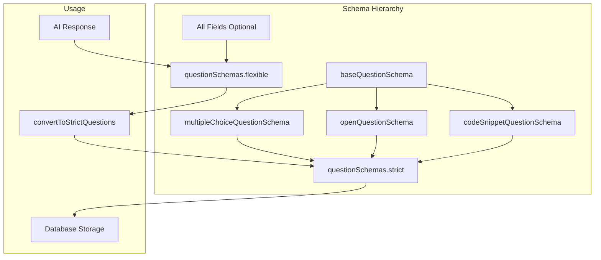

# Question Schemas Reference

This document provides a comprehensive reference for the Zod validation schemas used in DevRecruit's question system.

## Table of Contents

- [Schema Overview](#schema-overview)
- [Base Schema](#base-schema)
- [Question Type Schemas](#question-type-schemas)
- [Flexible vs Strict](#flexible-vs-strict)
- [Type Guards](#type-guards)
- [Conversion Utilities](#conversion-utilities)
- [Usage Patterns](#usage-patterns)

## Schema Overview



## Base Schema

All question types extend from a common base schema:

```typescript
const baseQuestionSchema = z.object({
  question: z.string().min(1, "Question text is required"),
  keywords: z.array(z.string()).optional(),
  explanation: z.string().optional(),
});
```

### Base Fields

| Field         | Type       | Required | Description                       |
| ------------- | ---------- | -------- | --------------------------------- |
| `question`    | `string`   | ✅       | The question text (Italian)       |
| `keywords`    | `string[]` | ❌       | Relevant keywords for evaluation  |
| `explanation` | `string`   | ❌       | Explanation of the correct answer |

## Question Type Schemas

### Multiple Choice Schema

```typescript
const multipleChoiceQuestionSchema = baseQuestionSchema.extend({
  type: z.literal("multiple_choice"),
  options: z
    .array(z.string().min(3, "Each option must be at least 3 characters long"))
    .min(4, "Must be at least 4 options"),
  correctAnswer: z.coerce.number<number>().int().min(0).max(3),
});
```

| Field           | Type                | Required | Constraints                   |
| --------------- | ------------------- | -------- | ----------------------------- |
| `type`          | `"multiple_choice"` | ✅       | Literal discriminator         |
| `options`       | `string[]`          | ✅       | Min 4 items, each min 3 chars |
| `correctAnswer` | `number`            | ✅       | 0-3 (zero-based index)        |

**Example:**

```json
{
  "type": "multiple_choice",
  "question": "Qual è il principale vantaggio di usare TypeScript?",
  "options": [
    "Tipizzazione statica che previene errori",
    "Esecuzione più veloce del codice",
    "Minore dimensione del bundle",
    "Compatibilità con tutti i browser"
  ],
  "correctAnswer": 0,
  "keywords": ["TypeScript", "type safety"],
  "explanation": "TypeScript fornisce tipizzazione statica che aiuta a identificare errori durante lo sviluppo."
}
```

### Open Question Schema

```typescript
const openQuestionSchema = baseQuestionSchema.extend({
  type: z.literal("open_question"),
  sampleAnswer: z.string().min(1, "Sample answer required"),
  sampleSolution: z.string().optional(),
  codeSnippet: z.string().optional(),
});
```

| Field            | Type              | Required | Description                    |
| ---------------- | ----------------- | -------- | ------------------------------ |
| `type`           | `"open_question"` | ✅       | Literal discriminator          |
| `sampleAnswer`   | `string`          | ✅       | Expected answer for evaluation |
| `sampleSolution` | `string`          | ❌       | Code solution if applicable    |
| `codeSnippet`    | `string`          | ❌       | Reference code snippet         |

**Example:**

```json
{
  "type": "open_question",
  "question": "Spiega la differenza tra useEffect e useLayoutEffect in React.",
  "sampleAnswer": "useEffect viene eseguito in modo asincrono dopo il render, mentre useLayoutEffect viene eseguito in modo sincrono prima che il browser dipinga. useLayoutEffect è utile per misurazioni DOM e animazioni.",
  "keywords": ["React", "hooks", "useEffect", "useLayoutEffect"],
  "explanation": "Valutare la comprensione del ciclo di rendering React."
}
```

### Code Snippet Schema

```typescript
const codeSnippetQuestionSchema = baseQuestionSchema.extend({
  type: z.literal("code_snippet"),
  codeSnippet: z.string().min(1, "Code snippet required"),
  sampleSolution: z.string().min(1, "Sample solution required"),
  language: z.string().min(1, "Programming language required"),
});
```

| Field            | Type             | Required | Description             |
| ---------------- | ---------------- | -------- | ----------------------- |
| `type`           | `"code_snippet"` | ✅       | Literal discriminator   |
| `codeSnippet`    | `string`         | ✅       | Code to analyze/fix     |
| `sampleSolution` | `string`         | ✅       | Corrected/improved code |
| `language`       | `string`         | ✅       | Programming language    |

**Example:**

```json
{
  "type": "code_snippet",
  "question": "Il seguente codice contiene un bug di sicurezza. Identificalo e correggi.",
  "codeSnippet": "const query = `SELECT * FROM users WHERE id = ${userId}`;",
  "sampleSolution": "const query = 'SELECT * FROM users WHERE id = $1';\nawait db.query(query, [userId]);",
  "language": "javascript",
  "keywords": ["SQL injection", "security", "parameterized queries"],
  "explanation": "Il codice originale è vulnerabile a SQL injection. La soluzione usa query parametrizzate."
}
```

### Behavioral Scenario Schema

```typescript
const behavioralScenarioQuestionSchema = baseQuestionSchema.extend({
  type: z.literal("behavioral_scenario"),
  sampleAnswer: z.string().min(1, "Sample answer required"),
});
```

| Field          | Type                    | Required | Description                         |
| -------------- | ----------------------- | -------- | ----------------------------------- |
| `type`         | `"behavioral_scenario"` | ✅       | Literal discriminator               |
| `sampleAnswer` | `string`                | ✅       | Strong example response for scoring |

**Example:**

```json
{
  "type": "behavioral_scenario",
  "question": "Un collega propone di saltare i test per rispettare la scadenza. Come ti comporti?",
  "sampleAnswer": "Bilancio urgenza e qualità: propongo scope ridotto, test minimi critici e allineo il team sui rischi.",
  "keywords": ["comunicazione", "trade-off", "qualità"],
  "explanation": "Valutare capacità di mediazione, consapevolezza dei rischi e orientamento alla qualità."
}
```

## Flexible vs Strict

### Flexible Schema

Used for parsing AI responses and existing data where not all fields may be present:

```typescript
const flexibleSchema = z.object({
  id: z.string(),
  type: baseSchemas.questionType,
  question: z.string().min(1, "Question text required"),
  options: z.array(z.string()).optional(),
  correctAnswer: z.coerce.number<number>().optional(),
  explanation: z.string().optional(),
  sampleAnswer: z.string().optional(),
  keywords: z.array(z.string()).optional(),
  language: z.string().optional(),
  codeSnippet: z.string().optional(),
  sampleSolution: z.string().optional(),
}).superRefine((data, ctx) => {
  // Type-specific validation
  if (data.type === "multiple_choice") {
    if (!data.options || data.options.length < 4) {
      ctx.addIssue({ ... });
    }
  }
});
```

### Strict Schema

Discriminated union for type-safe runtime operations:

```typescript
const strictSchema = z.discriminatedUnion("type", [
  multipleChoiceQuestionSchema,
  openQuestionSchema,
  codeSnippetQuestionSchema,
]);
```

### When to Use Each

| Schema     | Use Case                                              |
| ---------- | ----------------------------------------------------- |
| `flexible` | Parsing AI responses, legacy data, form inputs        |
| `strict`   | Type-safe operations, database storage, API responses |

## Type Guards

Runtime type checking utilities:

```typescript
import {
  isMultipleChoiceQuestion,
  isOpenQuestion,
  isCodeSnippetQuestion,
} from "@/lib/schemas";

// Usage
if (isMultipleChoiceQuestion(question)) {
  // TypeScript knows: question.options, question.correctAnswer
  console.log(question.options[question.correctAnswer]);
}

if (isCodeSnippetQuestion(question)) {
  // TypeScript knows: question.codeSnippet, question.sampleSolution, question.language
  console.log(`Language: ${question.language}`);
}
```

## Conversion Utilities

### Single Question Conversion

```typescript
import { convertToStrictQuestion } from "@/lib/schemas";

const flexibleQuestion = {
  id: "q1",
  type: "open_question",
  question: "What is React?",
  // sampleAnswer missing - will be added
};

const strictQuestion = convertToStrictQuestion(flexibleQuestion);
// Now has sampleAnswer: "Sample answer to be provided"
```

### Array Conversion

```typescript
import { convertToStrictQuestions } from "@/lib/schemas";

const aiResponse = [
  { id: "q1", type: "code_snippet", question: "...", codeSnippet: "..." },
  // sampleSolution and language missing
];

const questions = convertToStrictQuestions(aiResponse);
// All questions now have required fields filled with defaults
```

### Default Values Applied

| Question Type   | Missing Field    | Default Value                         |
| --------------- | ---------------- | ------------------------------------- |
| `open_question` | `sampleAnswer`   | `"Sample answer to be provided"`      |
| `code_snippet`  | `sampleSolution` | `"// Sample solution to be provided"` |
| `code_snippet`  | `codeSnippet`    | `"// Code snippet to be provided"`    |
| `code_snippet`  | `language`       | `"javascript"`                        |

## Usage Patterns

### In Server Actions

```typescript
import { questionSchemas, convertToStrictQuestions } from "@/lib/schemas";

export async function saveQuiz(questions: unknown[]) {
  // Parse with flexible schema (accepts partial data)
  const parsed = z.array(questionSchemas.flexible).parse(questions);

  // Convert to strict for storage
  const strict = convertToStrictQuestions(parsed);

  // Validate strict format
  const validated = z.array(questionSchemas.strict).parse(strict);

  // Save to database
  await prisma.quiz.create({
    data: { questions: validated },
  });
}
```

### In React Components

```typescript
import { Question, isMultipleChoiceQuestion } from "@/lib/schemas";

function QuestionDisplay({ question }: { question: Question }) {
  if (isMultipleChoiceQuestion(question)) {
    return (
      <RadioGroup>
        {question.options.map((option, i) => (
          <RadioGroupItem
            key={i}
            value={String(i)}
            className={i === question.correctAnswer ? "correct" : ""}
          />
        ))}
      </RadioGroup>
    );
  }

  // Handle other types...
}
```

### In Form Validation

```typescript
import { questionSchemas } from "@/lib/schemas";
import { useForm } from "react-hook-form";
import { zodResolver } from "@hookform/resolvers/zod";

const form = useForm({
  resolver: zodResolver(questionSchemas.strict),
  defaultValues: {
    id: "q1",
    type: "multiple_choice",
    question: "",
    options: ["", "", "", ""],
    correctAnswer: 0,
  },
});
```

## TypeScript Types

Exported types for use throughout the application:

```typescript
// Strict union type
export type Question = z.infer<typeof questionSchemas.strict>;

// Flexible type (all fields optional except core)
export type FlexibleQuestion = z.infer<typeof questionSchemas.flexible>;

// Individual question types
export type MultipleChoiceQuestion = z.infer<
  typeof multipleChoiceQuestionSchema
>;
export type OpenQuestion = z.infer<typeof openQuestionSchema>;
export type CodeSnippetQuestion = z.infer<typeof codeSnippetQuestionSchema>;
export type BehavioralScenarioQuestion = z.infer<
  typeof behavioralScenarioQuestionSchema
>;
```

## Question Entity (Database Model)

In addition to the inline question schemas used for AI generation and form validation, there is a database `Question` entity that allows questions to be stored independently and reused across multiple quizzes.

### Database Schema

```prisma
model Question {
  id             String   @id @default(cuid())
  type           QuestionType
  question       String
  keywords       String[] @default([])
  explanation    String?

  // Multiple choice fields
  options        String[] @default([])
  correctAnswer  Int?

  // Open question fields
  sampleAnswer   String?

  // Code snippet fields
  codeSnippet    String?
  sampleSolution String?
  language       String?

  // Favorites feature
  isFavorite     Boolean  @default(false)

  // Metadata
  createdBy      String
  createdAt      DateTime @default(now())
  updatedAt      DateTime @updatedAt
}

model QuizQuestion {
  id         String   @id @default(cuid())
  quizId     String
  questionId String
  order      Int      // Order of question in the quiz
}

enum QuestionType {
  multiple_choice
  open_question
  code_snippet
  behavioral_scenario
}
```

### Entity Schemas

Located in `lib/schemas/questionEntity.ts`:

| Schema                     | Purpose                                   |
| -------------------------- | ----------------------------------------- |
| `createQuestionSchema`     | Validate input for creating new questions |
| `updateQuestionSchema`     | Validate input for updating questions     |
| `questionEntitySchema`     | Full question entity from database        |
| `addQuestionsToQuizSchema` | Add questions to a quiz                   |
| `questionFilterSchema`     | Filter/search questions                   |

### Server Actions

Located in `lib/actions/questions.ts`:

| Action                         | Description                       |
| ------------------------------ | --------------------------------- |
| `createQuestionAction`         | Create a new reusable question    |
| `updateQuestionAction`         | Update an existing question       |
| `deleteQuestionAction`         | Delete a question                 |
| `toggleQuestionFavoriteAction` | Toggle favorite status            |
| `addQuestionsToQuizAction`     | Add questions to a quiz           |
| `removeQuestionFromQuizAction` | Remove question from quiz         |
| `reorderQuizQuestionsAction`   | Reorder questions in a quiz       |
| `createBulkQuestionsAction`    | Create multiple questions at once |

### Data Helpers

Located in `lib/data/questions.ts`:

| Function                  | Description                          |
| ------------------------- | ------------------------------------ |
| `getQuestions`            | Get paginated questions with filters |
| `getQuestionById`         | Get single question by ID            |
| `getFavoriteQuestions`    | Get all favorite questions           |
| `getQuestionsCountByType` | Count questions grouped by type      |
| `getQuizQuestions`        | Get questions linked to a quiz       |
| `searchQuestions`         | Search questions by text             |

### Usage Example

```typescript
import {
  createQuestionAction,
  toggleQuestionFavoriteAction,
} from "@/lib/actions/questions";
import { getQuestions, getFavoriteQuestions } from "@/lib/data/questions";

// Create a reusable question
const result = await createQuestionAction({
  type: "multiple_choice",
  question: "What is React?",
  options: ["A library", "A framework", "A language", "A database"],
  correctAnswer: 0,
  keywords: ["React", "frontend"],
  isFavorite: false,
});

// Get favorite questions
const favorites = await getFavoriteQuestions();

// Toggle favorite
await toggleQuestionFavoriteAction(questionId);
```

---

## Quiz-Question Integration

The system supports two storage approaches for quiz questions:

1. **Inline JSON Questions** (legacy): Questions stored as JSON in `Quiz.questions`
2. **Linked Question Entities** (new): Questions stored in `Question` table, linked via `QuizQuestion` join table

### Backward Compatibility

Quiz data helpers automatically handle both approaches:

- When fetching quiz questions, linked entities are preferred over inline JSON
- Existing quizzes with JSON questions continue to work
- New quizzes can use either approach or a combination

### Quiz-Question Server Actions

Additional actions in `lib/actions/questions.ts` for quiz integration:

| Action                                    | Description                                            |
| ----------------------------------------- | ------------------------------------------------------ |
| `saveQuestionToLibraryAction`             | Convert a single inline question to a library entity   |
| `saveQuestionsToLibraryAction`            | Bulk convert inline questions to library entities      |
| `saveQuizQuestionsToLibraryAndLinkAction` | Save inline questions to library AND link them to quiz |
| `linkLibraryQuestionsToQuizAction`        | Link existing library questions to a quiz              |

### Quiz Data Helpers (Updated)

The `lib/data/quizzes.ts` module now supports linked questions:

```typescript
import { getQuizById, getQuestionsForQuiz } from "@/lib/data/quizzes";

// Get quiz with linked questions (automatically prefers linked over JSON)
const quiz = await getQuizById(quizId);
// quiz.questions contains questions (from linked or JSON)
// quiz.hasLinkedQuestions indicates if using linked entities

// Get questions with explicit source preference
const questions = await getQuestionsForQuiz(quizId, {
  preferLinked: true, // Use linked entities if available
  fallbackToJson: true, // Fall back to JSON if no linked questions
});
```

### Question Library Helpers

Additional helpers in `lib/data/questions.ts`:

| Function                       | Description                                    |
| ------------------------------ | ---------------------------------------------- |
| `getLinkedQuestionIds`         | Get IDs of questions already linked to a quiz  |
| `getAvailableQuestionsForQuiz` | Get library questions not yet linked to a quiz |
| `QuestionWithMetadata` type    | Question with usage count and linked quiz info |

### Workflow Examples

#### Save AI-generated questions to library

```typescript
import { saveQuizQuestionsToLibraryAndLinkAction } from "@/lib/actions/questions";

// After AI generates questions for a quiz
const result = await saveQuizQuestionsToLibraryAndLinkAction({
  quizId: quiz.id,
  questions: generatedQuestions, // FlexibleQuestion[]
  markAsFavorite: true, // Optional: mark all as favorites
});

if (result.success) {
  console.log(`Saved ${result.data.questions.length} questions to library`);
}
```

#### Link existing library questions to a new quiz

```typescript
import { linkLibraryQuestionsToQuizAction } from "@/lib/actions/questions";
import { getAvailableQuestionsForQuiz } from "@/lib/data/questions";

// Get available questions (not already linked)
const available = await getAvailableQuestionsForQuiz(quizId, {
  type: "multiple_choice",
  isFavorite: true,
});

// Link selected questions to the quiz
const result = await linkLibraryQuestionsToQuizAction({
  quizId,
  questionIds: selectedQuestionIds,
});
```

#### Mix library and new questions

```typescript
import { addQuestionsToQuizAction } from "@/lib/actions/questions";

// Add library questions with specific order
await addQuestionsToQuizAction({
  quizId,
  questionIds: [
    { id: libraryQuestion1Id, order: 0 },
    { id: libraryQuestion2Id, order: 1 },
    { id: newlyCreatedQuestionId, order: 2 },
  ],
});
```

### Data Flow Diagram

```text
┌─────────────────────────────────────────────────────────────────┐
│                        QUIZ CREATION                            │
├─────────────────────────────────────────────────────────────────┤
│                                                                 │
│  ┌──────────────┐     ┌──────────────────┐                     │
│  │ AI Generate  │────▶│ Inline JSON      │                     │
│  │ Questions    │     │ (Quiz.questions) │                     │
│  └──────────────┘     └────────┬─────────┘                     │
│                                │                                │
│                                ▼                                │
│                    ┌───────────────────────┐                   │
│                    │ saveQuizQuestionsTo   │                   │
│                    │ LibraryAndLinkAction  │                   │
│                    └───────────┬───────────┘                   │
│                                │                                │
│                                ▼                                │
│  ┌──────────────┐     ┌──────────────────┐                     │
│  │ Question     │◀────│ QuizQuestion     │                     │
│  │ Library      │     │ (join table)     │                     │
│  └──────────────┘     └──────────────────┘                     │
│         │                      │                                │
│         │                      │                                │
│         ▼                      ▼                                │
│  ┌──────────────┐     ┌──────────────────┐                     │
│  │ Reuse in     │     │ Quiz displays    │                     │
│  │ other quizzes│     │ linked questions │                     │
│  └──────────────┘     └──────────────────┘                     │
│                                                                 │
└─────────────────────────────────────────────────────────────────┘
```

### Cache Tags

Question-related cache tags for invalidation:

| Tag                       | Used By                             |
| ------------------------- | ----------------------------------- |
| `questions`               | All question listing functions      |
| `questions-{userId}`      | User's questions                    |
| `question-{id}`           | Single question by ID               |
| `questions-favorites`     | Favorite questions list             |
| `quiz-questions-{quizId}` | Questions linked to a specific quiz |

---

## Related Documentation

- [AI Quiz Generation System](./AI_QUIZ_GENERATION.md) - How questions are generated
- [Cache Implementation](./CACHE_IMPLEMENTATION.md) - Data caching patterns
